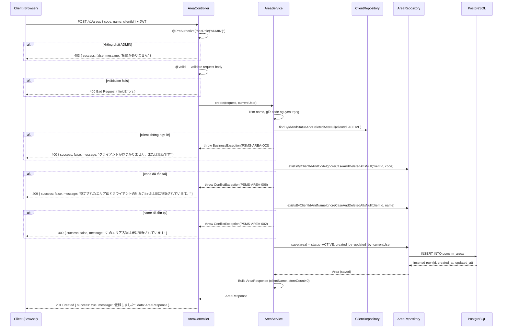

# Detail Design — M-02-cud Area Create

## 1. Document Info

| Item | Value |
|---|---|
| Feature | Quản lý khu vực (エリア) — Tạo mới |
| Screen ID | M-02-cud (Drawer — chế độ **新規登録**) |
| Related List | M-02 (`/area`) |
| Source | `documents/dev-basic-design/masters/areas/areas-create/basic-design.md` |
| DB Design | `specs/db-designs/db-overview/v3/1834-db-design.dbml` |
| Author | tiendv@hblab.vn |
| Reviewer | (pending) |
| Created | 2026-04-21 |
| Status | Draft |

---

## 2. Overview

API `POST /v1/areas` — Tạo mới một khu vực (`Area`) trong phạm vi một khách hàng (`Client`). Người dùng nhập **Mã khu vực (`code`)**, **Tên khu vực (`name`)** và chọn **Khách hàng (`clientId`)** trong Drawer của màn hình M-02. Sau khi validate và pass các kiểm tra nghiệp vụ, bản ghi được lưu vào `psms.m_areas` với `status = 'ACTIVE'` và `created_by = updated_by = currentUser.email`.

**Actors:**
- ADMIN (管理者) — duy nhất được phép gọi API này.

**Preconditions:**
- Người dùng đã đăng nhập, token JWT còn hiệu lực.
- Role của user là `ADMIN`.
- Đã tồn tại ít nhất một `Client` ở trạng thái `ACTIVE` và chưa xóa mềm.

**Postconditions:**
- Insert 1 bản ghi mới vào `psms.m_areas` với `code`, `name`, `client_id` do user nhập.
- `status = 'ACTIVE'`, `deleted_at = NULL`.
- Không tạo side effect tới các bảng khác (delivery center, store...).
- Response trả về `AreaResponse` đã hydrate `clientName` và `storeCount = 0`.

---

## 3. DB Schema

> Nguồn: DBML v3.1 (`specs/db-designs/db-overview/v3/1834-db-design.dbml`). Dùng **nguyên xi** — không thêm/sửa cột.

### Table `psms.m_areas` (primary — INSERT)

| Column | Type | Constraints | Mô tả |
|---|---|---|---|
| `id` | `BIGSERIAL` | PK | Khóa chính, sinh tự động |
| `code` | `VARCHAR(20)` | NOT NULL | エリアID — user nhập |
| `name` | `VARCHAR(255)` | NOT NULL | エリア名 — user nhập |
| `client_id` | `BIGINT` | NOT NULL, FK → `m_clients.id` | Khu vực thuộc khách hàng nào |
| `description` | `VARCHAR(1000)` | nullable | Ghi chú — không hiển thị ở UI Drawer, luôn NULL khi tạo |
| `status` | `VARCHAR(20)` | NOT NULL, DEFAULT `'ACTIVE'` | `ACTIVE` / `INACTIVE` — fix `'ACTIVE'` khi tạo |
| `created_at` | `TIMESTAMPTZ` | NOT NULL, DEFAULT `now()` | Audit |
| `created_by` | `VARCHAR(100)` | NOT NULL | Email của user tạo |
| `updated_at` | `TIMESTAMPTZ` | NOT NULL, DEFAULT `now()` | Audit |
| `updated_by` | `VARCHAR(100)` | NOT NULL | Email của user sửa cuối |
| `deleted_at` | `TIMESTAMPTZ` | nullable | Xóa mềm — NULL khi tạo |
| `deleted_by` | `VARCHAR(100)` | nullable | — |

**Unique constraints:**
- `uq_m_area_client_code` — `(client_id, code)`
- `uq_m_area_client_name` — `(client_id, name)`

**Indexes:** `idx_m_area_client_id (client_id)`, `idx_m_area_status (status)`.

### Table `psms.m_clients` (referenced — validate & JOIN)

| Column | Type | Vai trò |
|---|---|---|
| `id` | `BIGSERIAL` | PK, giá trị trong request `clientId` |
| `name` | `VARCHAR(255)` | Hiển thị trong response (`clientName`) |
| `status` | `VARCHAR(20)` | Chỉ `ACTIVE` + `deleted_at IS NULL` mới hợp lệ |
| `deleted_at` | `TIMESTAMPTZ` | Loại khỏi validate khi khác NULL |

---

## 4. API Endpoints Summary

| # | Method | Path | Mô tả | Auth |
|---|---|---|---|---|
| 1 | `POST` | `/v1/areas` | Tạo mới một Area | `ROLE_ADMIN` |

---

## 5. API Detail

### 5.1 POST /v1/areas

**Purpose:** Tạo mới một khu vực từ Drawer M-02-cud (chế độ 新規登録).

#### Authorization

`@PreAuthorize("hasRole('ADMIN')")` — ADMIN only. LOGISTICS bị chặn → 403.

#### Request Headers

| Header | Required | Value |
|---|---|---|
| `Authorization` | Yes | `Bearer <JWT>` |
| `Content-Type` | Yes | `application/json; charset=utf-8` |

#### Request Body

```json
{
  "code": "01",
  "name": "関西",
  "clientId": 10
}
```

| Field | Type | Required | Validation |
|---|---|---|---|
| `code` | `String` | Yes | `@NotBlank`, `@Size(max=20)`, `@Pattern(regexp="^[a-zA-Z0-9\\-]+$")` — 半角英数字 + hyphen |
| `name` | `String` | Yes | `@NotBlank`, `@Size(min=1, max=255)`; trim đầu/cuối trước khi kiểm tra trùng |
| `clientId` | `Long` | Yes | `@NotNull` |

#### Response

**201 Created:**

```json
{
  "success": true,
  "message": "登録しました",
  "data": {
    "id": 5,
    "code": "01",
    "name": "関西",
    "clientId": 10,
    "clientName": "ファミリーマート",
    "storeCount": 0,
    "status": "ACTIVE"
  }
}
```

| Field | Type | Mô tả |
|---|---|---|
| `id` | `Long` | ID bản ghi vừa tạo |
| `code` | `String` | Mã khu vực user đã nhập |
| `name` | `String` | Tên khu vực user đã nhập (đã trim) |
| `clientId` | `Long` | ID client đã chọn |
| `clientName` | `String` | Tên client (lấy từ `m_clients.name`) |
| `storeCount` | `Long` | Luôn là `0` khi vừa tạo |
| `status` | `String` | `"ACTIVE"` |

#### Business Logic

1. Bộ lọc JWT xác thực token, `@PreAuthorize` chặn non-ADMIN → 403.
2. `@Valid` validate request body → nếu fail → 400 kèm `fieldErrors` map.
3. Trim `name` (đầu/cuối); giữ nguyên `code` (không trim — chỉ cho phép ký tự hợp lệ).
4. Tra `Client` theo `clientId` với điều kiện `status = 'ACTIVE'` và `deleted_at IS NULL` (`ClientRepository.findByIdAndStatusAndDeletedAtIsNull`). Không hợp lệ → ném `BusinessException(PSMS-AREA-003)` → 400.
5. Kiểm tra `code` **unique trong cùng `client_id`**, bỏ qua các bản ghi đã xóa mềm (`AreaRepository.existsByClientIdAndCodeIgnoreCaseAndDeletedAtIsNull`). Trùng → ném `ConflictException(PSMS-AREA-006)` → 409.
6. Kiểm tra `name` **unique trong cùng `client_id`**, bỏ qua các bản ghi đã xóa mềm (`AreaRepository.existsByClientIdAndNameIgnoreCaseAndDeletedAtIsNull`). Trùng → ném `ConflictException(PSMS-AREA-002)` → 409.
7. Map request → `Area` entity: `code`, `name` (trimmed), `client_id`, `status = 'ACTIVE'`, `created_by = updated_by = currentUser.email`, `description = NULL`.
8. `AreaRepository.save(area)` — JPA sinh `id`, `created_at`, `updated_at` (DB default).
9. Build `AreaResponse`: hydrate `clientName` từ `Client` đã tra, `storeCount = 0` (không query `m_stores` vì vừa tạo).
10. Controller trả `201 Created` kèm `ApiResponse.ok("登録しました", response)`.

#### Error Cases

| HTTP | Error Code | Condition | Message (hiển thị user) |
|---|---|---|---|
| 400 | — | `@Valid` fail (thiếu field, sai format) | Field-level errors (xem bảng phía dưới) |
| 400 | `PSMS-AREA-003` | `clientId` không tồn tại hoặc không `ACTIVE` hoặc đã xóa mềm | `クライアントが見つかりません、または無効です` |
| 401 | — | Thiếu / sai JWT | `認証が必要です` |
| 403 | — | User không phải ADMIN | `権限がありません` |
| 409 | `PSMS-AREA-006` | `code` trùng trong cùng `client_id` | `指定されたエリアIDとクライアントの組み合わせは既に登録されています。` |
| 409 | `PSMS-AREA-002` | `name` trùng trong cùng `client_id` | `このエリア名称は既に登録されています` |
| 500 | — | Lỗi không mong đợi | `システムエラーが発生しました` |

#### Field Validation Errors

| Field | Rule | Message hiển thị |
|---|---|---|
| `code` | `@NotBlank` | `エリアIDを入力してください` |
| `code` | `@Size(max=20)` | `20文字以内で入力してください` |
| `code` | `@Pattern` fail | `半角英数字とハイフンのみで入力してください` |
| `name` | `@NotBlank` | `エリア名称を入力してください` |
| `name` | `@Size(min=1)` | `1文字以上で入力してください` |
| `name` | `@Size(max=255)` | `255文字以内で入力してください` |
| `clientId` | `@NotNull` | `クライアントを入力してください` |

#### Sequence Diagram



---

## 6. DTO Definitions

### 6.1 AreaCreateRequest

```java
package jp.kreo.psms.dto.request;

import jakarta.validation.constraints.NotBlank;
import jakarta.validation.constraints.NotNull;
import jakarta.validation.constraints.Pattern;
import jakarta.validation.constraints.Size;

public record AreaCreateRequest(
    @NotBlank(message = "エリアIDを入力してください")
    @Size(max = 20, message = "20文字以内で入力してください")
    @Pattern(regexp = "^[a-zA-Z0-9\\-]+$",
             message = "半角英数字とハイフンのみで入力してください")
    String code,

    @NotBlank(message = "エリア名称を入力してください")
    @Size(min = 1, max = 255, message = "255文字以内で入力してください")
    String name,

    @NotNull(message = "クライアントを入力してください")
    Long clientId
) {}
```

### 6.2 AreaResponse

```java
package jp.kreo.psms.dto.response;

public record AreaResponse(
    Long id,
    String code,
    String name,
    Long clientId,
    String clientName,
    Long storeCount,
    String status
) {}
```

---

## 7. Repository Contracts

### AreaRepository (`JpaRepository<Area, Long>`)

| Method | Mục đích |
|---|---|
| `boolean existsByClientIdAndCodeIgnoreCaseAndDeletedAtIsNull(Long clientId, String code)` | Check `code` unique trong phạm vi client, bỏ qua bản ghi đã xóa mềm |
| `boolean existsByClientIdAndNameIgnoreCaseAndDeletedAtIsNull(Long clientId, String name)` | Check `name` unique trong phạm vi client, bỏ qua bản ghi đã xóa mềm |
| `<S extends Area> S save(S area)` | Inherit từ `JpaRepository` — insert mới |

### ClientRepository (`JpaRepository<Client, Long>`)

| Method | Mục đích |
|---|---|
| `Optional<Client> findByIdAndStatusAndDeletedAtIsNull(Long id, ClientStatus status)` | Tra client hợp lệ (ACTIVE, chưa xóa) để validate `clientId` và lấy `clientName` cho response |

---

## 8. Side Effects

Không có — API chỉ thực hiện `INSERT` vào `psms.m_areas`. Không gửi email, không gọi external API, không cập nhật bảng khác.

**Audit**: cột `created_by`, `updated_by`, `created_at`, `updated_at` được set khi insert (theo chuẩn Master Data).

---

## 9. Error Handling Summary

| Error Code | HTTP | Exception | Thrown by |
|---|---|---|---|
| `PSMS-AREA-002` | 409 | `ConflictException` | `AreaService.create` khi `name` trùng |
| `PSMS-AREA-003` | 400 | `BusinessException` | `AreaService.create` khi `clientId` không hợp lệ |
| `PSMS-AREA-006` | 409 | `ConflictException` | `AreaService.create` khi `code` trùng |
| — | 409 | `DataIntegrityViolationException` | Fallback concurrent insert vi phạm unique index `(client_id, code)` hoặc `(client_id, name)` — `GlobalExceptionHandler` map sang `ApiResponse.error("指定されたエリアIDとクライアントの組み合わせは既に登録されています。")` |
| Field validation | 400 | `MethodArgumentNotValidException` | `@Valid` trên `@RequestBody` — bắt ở `GlobalExceptionHandler` |
| Authorization | 403 | `AccessDeniedException` | `@PreAuthorize("hasRole('ADMIN')")` |
| Authentication | 401 | `AuthenticationException` | `JwtAuthenticationFilter` |

**Retry policy:** Không retry — đây là API ghi dữ liệu không idempotent (create). FE hiển thị toast lỗi, user sửa input rồi bấm lại **Lưu**.

---

## 10. Testing Scenarios

### Happy Path

| # | Scenario | Input | Expected |
|---|---|---|---|
| P-01 | Tạo Area hợp lệ | `{ code: "01", name: "関西", clientId: 10 }` | 201, `data.id` > 0, `clientName` và `storeCount=0` đúng |
| P-02 | `code` có dấu gạch nối | `{ code: "kansai-01", name: "関西", clientId: 10 }` | 201 |
| P-03 | `name` trùng nhưng khác client | `{ code: "02", name: "関西", clientId: 11 }` (client 10 đã có `"関西"`) | 201 |
| P-04 | `code` trùng nhưng khác client | `{ code: "01", name: "関東", clientId: 11 }` (client 10 đã có `"01"`) | 201 |
| P-05 | `name` có khoảng trắng đầu/cuối | `{ code: "03", name: "  関西  ", clientId: 10 }` | 201; `response.data.name == "関西"` (trimmed); `SELECT name FROM m_areas WHERE id = response.data.id` = `"関西"` (không whitespace) |

### Error — Validation

| # | Scenario | Input | Expected |
|---|---|---|---|
| V-01 | `code` rỗng | `{ code: "", name: "関西", clientId: 10 }` | 400, `fieldErrors.code = "エリアIDを入力してください"` |
| V-02 | `code` vượt 20 ký tự | `{ code: "A".repeat(21), ... }` | 400, `"20文字以内で入力してください"` |
| V-03 | `code` chứa ký tự không hợp lệ | `{ code: "エリア@@", ... }` | 400, `"半角英数字とハイフンのみで入力してください"` |
| V-04 | `name` rỗng | `{ code: "01", name: "", clientId: 10 }` | 400, `"エリア名称を入力してください"` |
| V-05 | `name` vượt 255 ký tự | `name = "あ".repeat(256)` | 400, `"255文字以内で入力してください"` |
| V-06 | `clientId` null | `{ code: "01", name: "関西" }` | 400, `"クライアントを入力してください"` |

### Error — Business

| # | Scenario | Input | Expected |
|---|---|---|---|
| B-01 | `clientId` không tồn tại | `clientId = 99999` | 400, `PSMS-AREA-003` |
| B-02 | `clientId` của client INACTIVE | Client status = `INACTIVE` | 400, `PSMS-AREA-003` |
| B-03 | `clientId` của client đã xóa mềm | `deleted_at IS NOT NULL` | 400, `PSMS-AREA-003` |
| B-04 | `code` trùng (case-insensitive) trong cùng client | DB có `"01"`, request gửi `"01"` | 409, `PSMS-AREA-006` |
| B-05 | `code` trùng (case khác) trong cùng client | DB có `"A1"`, request gửi `"a1"` | 409, `PSMS-AREA-006` |
| B-06 | `name` trùng (case-insensitive) trong cùng client | DB có `"関西"`, request gửi `"関西"` | 409, `PSMS-AREA-002` |
| B-07 | `name` trùng sau trim | DB có `"関西"`, request gửi `"  関西  "` | 409, `PSMS-AREA-002` |

### Error — Authorization

| # | Scenario | Input | Expected |
|---|---|---|---|
| A-01 | Không có token | No `Authorization` header | 401 |
| A-02 | Token hết hạn | Expired JWT | 401 |
| A-03 | Token LOGISTICS | Valid JWT với role `LOGISTICS` | 403 |

### Edge Cases

| # | Scenario | Input | Expected |
|---|---|---|---|
| E-01 | `code` với chữ cái viết hoa/thường hỗn hợp | `{ code: "Kansai-01", ... }` | 201 |
| E-02 | Insert song song 2 request cùng `(client_id, code)` | 2 request đồng thời | 1 × 201, 1 × 409 (DB unique constraint bảo vệ) |
| E-03 | `name` chỉ toàn khoảng trắng | `{ name: "   ", ... }` | 400 (sau khi trim coi như rỗng) — do `@NotBlank` áp dụng trước trim ở BE nên cần trim thủ công trong service trước khi validate unique; Jackson không trim tự động, `@NotBlank` trong Bean Validation coi chuỗi toàn khoảng trắng là invalid |

---

## 11. Notes & Assumptions

1. **Không có optimistic lock cho tạo mới.** Basic design có đề cập `楽観的ロック (updated_at)` nhưng chỉ áp dụng cho **Sửa/Xóa** — không liên quan tạo mới. Để an toàn trên concurrent insert, dựa vào unique index `(client_id, code)` và `(client_id, name)` ở DB — conflict → DataIntegrityViolationException → GlobalExceptionHandler map về 409.
2. **`description` luôn NULL khi tạo** — không có field này trên Drawer UI (basic design §3 không liệt kê).
3. **`status` fix `'ACTIVE'` khi tạo** — user không chọn status trong form tạo mới (basic design không có field này).
4. **Case-insensitive unique check** — cả `code` và `name` đều so sánh không phân biệt hoa thường để tránh user đăng ký gần trùng (ví dụ `"a1"` và `"A1"`).
5. **Không tạo audit log record riêng** — dùng cột `created_by` / `updated_by` của `m_areas` theo chuẩn Master Data hiện tại; `common-document` audit log framework chưa có đặc tả (basic design §5 đánh dấu TODO).
6. **Client `INACTIVE` và client đã xóa mềm** được gộp thành cùng lỗi `PSMS-AREA-003` — FE không cần phân biệt (M-01 đã ẩn các client này khỏi dropdown; nếu BE thấy `clientId` không hợp lệ nghĩa là FE caching cũ).
7. **Trùng `name`** → `409` (theo convention REST — conflict với resource hiện có), trùng `code` cũng `409` (cùng họ lỗi duplicate), không dùng 400.
8. **GAP-101** (tập ký tự cho `name`) — áp dụng đề xuất cơ bản: cho phép full-width/half-width chữ số và ký tự đặc biệt; chỉ giới hạn độ dài tối đa 255. Không áp regex đặc biệt cho `name`.
9. **GAP-102** (toast sau Lưu) — áp dụng `登録しました` (chuẩn tiếng Nhật cho Create), khác `送信成功` mà basic design đề xuất.

---

## 12. Revision History

| Version | Date | Author | Changes |
|---|---|---|---|
| 0.1 | 2026-04-21 | tiendv@hblab.vn | Draft đầu tiên theo template `/gen-detail-design`. Align table names (`m_areas`, `m_clients`) theo DBML v3.1. |
