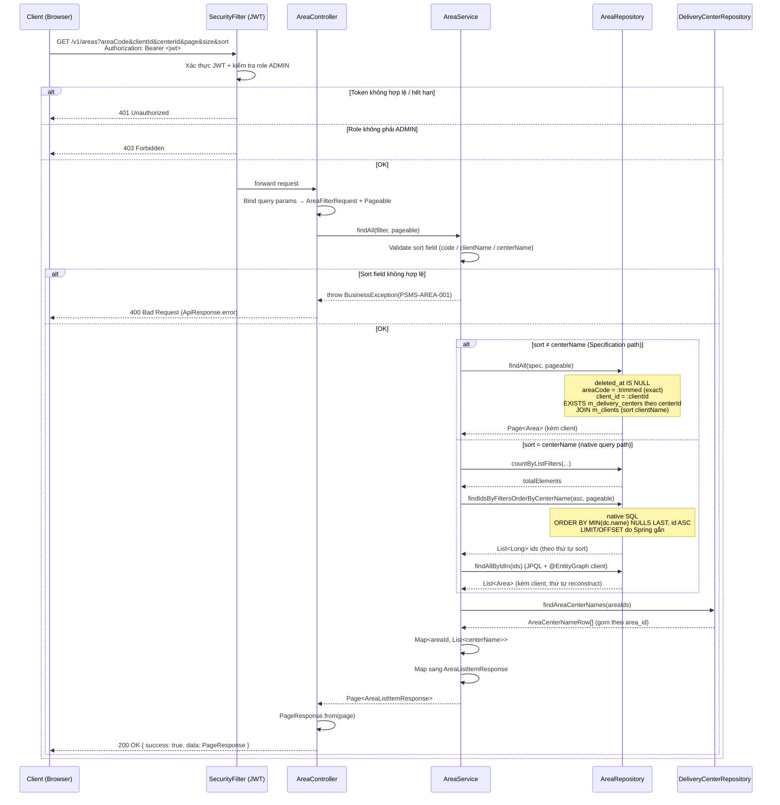

# Detail Design — M-02 Area List

## 1. Document Info

| Item | Value |
|---|---|
| Feature | Quản lý khu vực (エリア) — Danh sách |
| Screen ID | M-02 (list) |
| Related CUD | M-02-cud (Drawer — khác scope) |
| Source | `documents/dev-basic-design/masters/areas/areas-list/basic-design.md` |
| DB Design | `specs/db-designs/db-overview/v3/1834-db-design.dbml` |
| Author | tiendv@hblab.vn |
| Reviewer | (pending) |
| Created | 2026-04-21 |
| Status | Draft |

---

## 2. Overview

API trả danh sách Area cho màn hình **M-02 — エリア情報管理（一覧）**. Hỗ trợ lọc theo `areaCode` (khớp chính xác sau trim), `clientId` (dropdown), `centerId` (dropdown), sắp xếp theo 3 cột cho phép, và phân trang 30 dòng/trang.

**Actors:**
- ADMIN (管理者) — duy nhất được phép gọi API này.

**Preconditions:**
- Người dùng đã đăng nhập, token JWT còn hiệu lực.
- Role của user là `ADMIN`.

**Postconditions:**
- Trả về page danh sách Area (loại trừ các bản ghi đã xóa mềm).
- Không thay đổi trạng thái dữ liệu.

---

## 3. DB Schema

> Nguồn: DBML v3.1 (`specs/db-designs/db-overview/v3/1834-db-design.dbml`). Dùng **nguyên xi** — không thêm/sửa cột.

### Table `psms.m_areas` (primary)

| Column | Type | Constraints | Mô tả |
|---|---|---|---|
| `id` | `BIGSERIAL` | PK | Khóa chính |
| `code` | `VARCHAR(20)` | NOT NULL | エリアID (hiển thị trên UI — cột #7-1) |
| `name` | `VARCHAR(255)` | NOT NULL | エリア名 (UI cột #7-2) |
| `client_id` | `BIGINT` | NOT NULL, FK → `m_clients.id` | Khu vực thuộc client nào |
| `description` | `VARCHAR(1000)` | nullable | Ghi chú (không hiển thị ở list) |
| `status` | `VARCHAR(20)` | NOT NULL, DEFAULT `'ACTIVE'` | `ACTIVE` / `INACTIVE` |
| `created_at` | `TIMESTAMPTZ` | NOT NULL | — |
| `created_by` | `VARCHAR(100)` | NOT NULL | — |
| `updated_at` | `TIMESTAMPTZ` | NOT NULL | — |
| `updated_by` | `VARCHAR(100)` | NOT NULL | — |
| `deleted_at` | `TIMESTAMPTZ` | nullable | Xóa mềm — list ẩn khi có giá trị |
| `deleted_by` | `VARCHAR(100)` | nullable | — |

**Unique constraints:** `(client_id, code)` → `uq_m_area_client_code`; `(client_id, name)` → `uq_m_area_client_name`.
**Indexes:** `idx_m_area_client_id (client_id)`, `idx_m_area_status (status)`.

### Table `psms.m_clients` (JOIN — hiển thị `clientName`)

| Column | Type | Vai trò |
|---|---|---|
| `id` | `BIGSERIAL` | PK, target của FK `m_areas.client_id` |
| `name` | `VARCHAR(255)` | Hiển thị trong response (`clientName`) |
| `status` | `VARCHAR(20)` | `ACTIVE` / `INACTIVE` — không ảnh hưởng list, ảnh hưởng dropdown filter |
| `deleted_at` | `TIMESTAMPTZ` | Ẩn khỏi dropdown filter khi khác NULL |

### Table `psms.m_delivery_centers` (JOIN — filter `centerId` + hiển thị `centerNames`)

| Column | Type | Vai trò |
|---|---|---|
| `id` | `BIGSERIAL` | PK, giá trị truyền trong filter `centerId` |
| `name` | `VARCHAR(255)` | Hiển thị trong response (`centerNames[]`) |
| `area_id` | `BIGINT` | NOT NULL, FK → `m_areas.id` — 1 area có nhiều center |
| `status` | `VARCHAR(20)` | `ACTIVE` / `INACTIVE` |
| `deleted_at` | `TIMESTAMPTZ` | Ẩn khỏi JOIN khi khác NULL |

---

## 4. API Endpoints Summary

| # | Method | Path | Role | Description |
|---|---|---|---|---|
| 1 | GET | `/v1/areas` | ADMIN | Danh sách Area với filter, sort, pagination |

---

## 5. API Detail

### 5.1 GET /v1/areas

#### Authorization

- Security: `Bearer <JWT>` bắt buộc.
- Method-level: `@PreAuthorize("hasRole('ADMIN')")`.
- LOGISTICS hoặc user chưa đăng nhập → 403 / 401.

#### Request

**Headers:**

| Header | Required | Value |
|---|---|---|
| `Authorization` | Yes | `Bearer <token>` |
| `Accept` | No | `application/json` |

**Query Parameters:**

| Parameter | Type | Required | Default | Description |
|---|---|---|---|---|
| `areaCode` | `String` | No | — | Filter `m_areas.code` — trim đầu/cuối, sau đó **khớp chính xác** (case-sensitive). Rỗng sau trim → bỏ qua điều kiện |
| `clientId` | `Long` | No | — | Filter `m_areas.client_id = :clientId` |
| `centerId` | `Long` | No | — | Filter: chỉ trả các area có ít nhất một `m_delivery_centers` id = `:centerId` và `deleted_at IS NULL` |
| `page` | `int` | No | `0` | Chỉ số trang (bắt đầu 0) |
| `size` | `int` | No | `30` | Số dòng/trang — giữ cố định 30 theo basic-design §5 (GAP-002 mở) |
| `sort` | `String` | No | `code,asc` | Cặp `{field},{asc\|desc}`. **Field hợp lệ:** `code`, `clientName`, `centerName` |

**Sort rules:**
- Default: `code,asc` (theo GAP-001 — エリアID tăng dần).
- Chỉ 3 field được phép: `code` (エリアID), `clientName` (クライアント名), `centerName` (センター名).
- Field khác → 400 Bad Request.
- `clientName` → ORDER BY `m_clients.name`.
- `centerName` → ORDER BY giá trị `MIN(dc.name)` của các center không bị xóa mềm thuộc area (xem Business Logic bước 5).

#### Response

**200 OK** — `ApiResponse<PageResponse<AreaListItemResponse>>`

```json
{
  "success": true,
  "message": null,
  "data": {
    "content": [
      {
        "id": 12,
        "code": "01",
        "name": "関西",
        "clientId": 3,
        "clientName": "ファミリーマート",
        "centerNames": ["加古川配送センター", "神戸配送センター"],
        "status": "ACTIVE"
      }
    ],
    "page": 0,
    "size": 30,
    "totalElements": 120,
    "totalPages": 3
  }
}
```

**Response fields:**

| Field | Type | Source | Notes |
|---|---|---|---|
| `id` | `Long` | `m_areas.id` | — |
| `code` | `String` | `m_areas.code` | UI cột エリアID |
| `name` | `String` | `m_areas.name` | UI cột Tên khu vực |
| `clientId` | `Long` | `m_areas.client_id` | — |
| `clientName` | `String` | `m_clients.name` (JOIN) | UI cột Tên khách hàng |
| `centerNames` | `List<String>` | `m_delivery_centers.name` (JOIN, `deleted_at IS NULL`) | UI cột Tên trung tâm — một area có thể có nhiều center; giữ thứ tự theo `m_delivery_centers.name ASC`. Nếu không có center nào → `[]` |
| `status` | `String` | `m_areas.status` | `ACTIVE` / `INACTIVE` — UI có thể dùng để styling (không lọc) |

#### Business Logic

1. **Authorization check** — Spring Security xác minh JWT + role `ADMIN`. Không phải ADMIN → trả 401/403 (thông qua `GlobalExceptionHandler`).
2. **Sort validation** — parse `sort` param; kiểm tra field ∈ `{code, clientName, centerName}`. Nếu sai → ném `BusinessException` (HTTP 400).
3. **Build predicate** — áp dụng đồng thời (AND):
   - Mặc định: `m_areas.deleted_at IS NULL` (không lọc theo `status` — cả ACTIVE lẫn INACTIVE đều hiển thị).
   - Nếu `areaCode` có giá trị → `trimmed = areaCode.trim()`; nếu `!trimmed.isEmpty()` → `m_areas.code = :trimmed` (exact match).
   - Nếu `clientId` != null → `m_areas.client_id = :clientId`.
   - Nếu `centerId` != null → `EXISTS (SELECT 1 FROM m_delivery_centers dc WHERE dc.area_id = m_areas.id AND dc.id = :centerId AND dc.deleted_at IS NULL)`.
4. **Query main page** — có 2 đường dẫn:
   - **Sort = `code` / `clientName`:** JPA Specification + `Pageable`, JOIN `m_clients`.
     - `code` → `ORDER BY m_areas.code {dir}`.
     - `clientName` → `ORDER BY c.name {dir}`.
     - Tie-breaker: `m_areas.id ASC`.
   - **Sort = `centerName`:** native query 2-step (vì subquery trong `ORDER BY` không biểu diễn được qua `Pageable`):
     1. `SELECT a.id FROM m_areas a WHERE ... ORDER BY (SELECT MIN(dc.name) FROM m_delivery_centers dc WHERE dc.area_id = a.id AND dc.deleted_at IS NULL) {dir} NULLS LAST, a.id ASC` + LIMIT/OFFSET do Spring gắn.
     2. `findAllByIdIn(ids)` (JPQL + `@EntityGraph("client")`) → nạp entity kèm client, thứ tự được reconstruct theo list ID.
     3. `countByListFilters` chạy song song để có `totalElements`.
5. **Load centerNames** — sau khi có danh sách Area id của trang, batch query: `SELECT area_id, name FROM m_delivery_centers WHERE area_id IN (:ids) AND deleted_at IS NULL ORDER BY area_id, name ASC`. Gom thành `Map<Long, List<String>>`.
6. **Build response** — map sang `AreaListItemResponse`, gắn `centerNames` từ map (nếu thiếu key → `[]`).
7. **Wrap** — `PageResponse.from(page)` → `ApiResponse.ok(pageResponse)`.

#### Error Cases

| HTTP | Code | Message (JP) | Nguyên nhân |
|---|---|---|---|
| 400 | `PSMS-AREA-001` | `並び替えの項目が不正です。` | `sort` field không thuộc whitelist `{code, clientName, centerName}` |
| 400 | `PSMS-AREA-002` | `並び替えの方向が不正です。` | `sort` direction khác `asc` / `desc` |
| 401 | — | (Spring Security default) | Thiếu token hoặc token hết hạn |
| 403 | — | (Spring Security default) | User không phải role `ADMIN` |
| 500 | `PSMS-AREA-500` | `システムエラーが発生しました。` | DB lỗi / lỗi không kiểm soát |

#### Sequence Diagram



---

## 6. DTO Definitions

### 6.1 Request — Query param binding

```java
// jp.kreo.psms.dto.request.AreaFilterRequest
public record AreaFilterRequest(
    String areaCode,   // exact match after trim
    Long clientId,
    Long centerId
) {}
```

> `page`, `size`, `sort` được Spring bind qua `Pageable` (không đưa vào DTO).

### 6.2 Response — Item

```java
// jp.kreo.psms.dto.response.AreaListItemResponse
public record AreaListItemResponse(
    Long id,
    String code,
    String name,
    Long clientId,
    String clientName,
    List<String> centerNames,
    String status
) {}
```

### 6.3 Standard wrappers (đã có sẵn)

```java
// jp.kreo.psms.dto.response.ApiResponse<T>
// jp.kreo.psms.dto.response.PageResponse<T>
```

---

## 7. Error Handling Summary

| Error Code | HTTP | Exception | Where thrown |
|---|---|---|---|
| `PSMS-AREA-001` | 400 | `BusinessException` | `AreaServiceImpl#validateSort` — sort field không hợp lệ |
| `PSMS-AREA-002` | 400 | `BusinessException` | `AreaServiceImpl#validateSort` — sort direction không hợp lệ |
| `PSMS-AREA-500` | 500 | `Exception` (fallback) | `GlobalExceptionHandler#handleGeneral` |

**Retry policy:**

| Status | Retry | Ghi chú |
|---|---|---|
| 400 | No | Client sửa input rồi gọi lại |
| 401 | Sau khi refresh token | FE tự refresh hoặc chuyển về `/login` |
| 403 | No | User không đủ quyền |
| 500 | Có, exponential backoff | FE hiển thị modal lỗi kết nối (common-spec §4.1 — MSG-022) |

---

## 8. Testing Scenarios

### 8.1 Happy Path

| # | Scenario | Input | Expected |
|---|---|---|---|
| G-01 | Không filter, default sort | `GET /v1/areas` | 200, `sort=code,asc`, page 0, size 50, chỉ Area `deleted_at IS NULL` |
| G-02 | Exact match `areaCode` | `areaCode=01` | 200, chỉ Area có `code='01'` |
| G-03 | Filter `clientId` | `clientId=3` | 200, chỉ Area thuộc client 3 |
| G-04 | Filter `centerId` | `centerId=5` | 200, chỉ Area mà có delivery_center id=5 (và chưa xóa) |
| G-05 | Combine filter | `areaCode=01&clientId=3` | 200, AND logic |
| G-06 | Sort `clientName,desc` | `sort=clientName,desc` | 200, sắp xếp theo tên khách hàng giảm dần |
| G-07 | Sort `centerName,asc` | `sort=centerName,asc` | 200, sắp xếp theo MIN(tên center) tăng dần, NULLS LAST |
| G-08 | Pagination | `page=1&size=30` | 200, trả trang 2, giữ filter |
| G-09 | Area có nhiều center | — | 200, `centerNames` là array, thứ tự name ASC |
| G-10 | Area không có center | — | 200, `centerNames=[]` |

### 8.2 Edge Cases

| # | Scenario | Input | Expected |
|---|---|---|---|
| E-01 | `areaCode` có whitespace 2 đầu | `areaCode=  01  ` | 200, trim trước khi match exact |
| E-02 | `areaCode` rỗng sau trim | `areaCode=   ` | 200, bỏ qua điều kiện `areaCode` |
| E-03 | Area status INACTIVE | — | 200, vẫn hiển thị trong list (chỉ ẩn soft-deleted) |
| E-04 | Area đã xóa mềm | — | 200, không hiển thị |
| E-05 | Center đã xóa mềm của area | — | 200, `centerNames` không chứa center đó |
| E-06 | Không có kết quả | `areaCode=ZZZZ` | 200, `content=[]`, `totalElements=0` |

### 8.3 Error Cases

| # | Scenario | Input | Expected |
|---|---|---|---|
| X-01 | Thiếu JWT | no `Authorization` | 401 |
| X-02 | JWT hết hạn | expired token | 401 |
| X-03 | Role LOGISTICS | LOGISTICS token | 403 |
| X-04 | Sort field sai | `sort=description,asc` | 400, `PSMS-AREA-001` |
| X-05 | Sort direction sai | `sort=code,up` | 400, `PSMS-AREA-002` |

---

## 9. Notes & Assumptions

1. **Sort `centerName` với area có nhiều center:** chọn `MIN(center.name)` + `NULLS LAST` để đảm bảo thứ tự ổn định, tie-breaker `m_areas.id ASC`. Thực hiện qua native @Query 2-step (IDs + entities) vì `Pageable` không biểu diễn được subquery trong `ORDER BY`. Basic-design không định nghĩa chi tiết — assumption này cần xác nhận với PM nếu khách hàng có phản hồi khác.
2. **Không lọc theo `status` của area** trong list (basic-design chỉ nói soft-delete). INACTIVE vẫn hiển thị — phù hợp common-spec §5.6 ("INACTIVE hiển thị được trong list").
3. **`size` cố định 30:** basic-design đánh dấu GAP-002 về cho phép đổi page size. Implementation hiện tại nhận `size` từ query để mở cho tương lai, nhưng UI hiện chỉ truyền 30.
4. **`areaCode` exact match** (không ILIKE partial) theo basic-design Mục 3 phần tử #2. Không áp dụng rule common-spec §5.6 "bỏ space/ignore case" cho filter này (basic-design specific thắng common rule).
5. **`centerId` filter dùng `EXISTS`** thay vì JOIN DISTINCT — tránh nhân bản row khi area có nhiều center không liên quan filter.
6. **`centerNames` load qua batch query** sau khi đã phân trang → tránh N+1, đồng thời không ảnh hưởng `totalElements`.
7. **Open question (GAP-003):** pulldown filter center hiện chưa có trên Figma. Backend vẫn expose `centerId` để FE có thể kích hoạt sau. Nếu PM confirm không cần → ẩn param, không cần migration.
8. **Cột `description` của `m_areas`** không hiển thị ở list (theo basic-design). Chỉ dùng ở M-02-cud.
