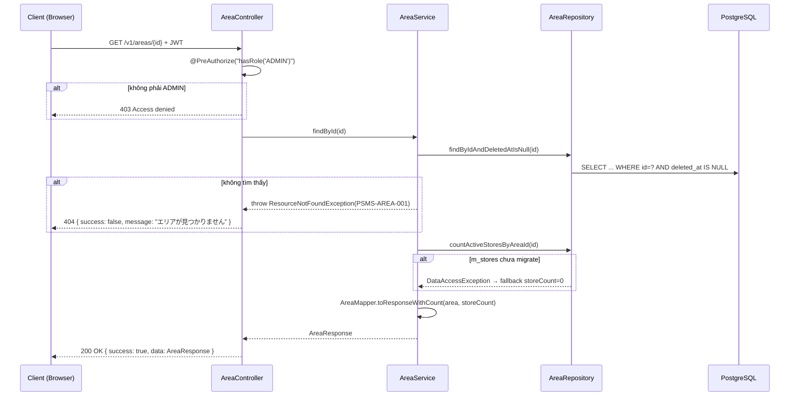

# Detail Design — M-02-cud Area Update

## 1. Document Info

| Item | Value |
|---|---|
| Feature | Quản lý khu vực (エリア) — Xem chi tiết & Cập nhật |
| Screen ID | M-02-cud (Drawer — chế độ **編集**) |
| Related List | M-02 (`/area`) |
| Related Ops | areas-create (POST), areas-delete (DELETE) |
| Source | `documents/dev-basic-design/masters/areas/areas-update/basic-design.md` |
| DB Design | `specs/db-designs/db-overview/v3/1834-db-design.dbml` |
| Author | tiendv@hblab.vn |
| Reviewer | (pending) |
| Created | 2026-04-21 |
| Status | Draft |

---

## 2. Overview

Hai endpoint phục vụ Drawer chế độ **編集** trên màn hình M-02:

1. `GET /v1/areas/{id}` — Load chi tiết một Area (bao gồm `clientName` và `storeCount` hiện tại) để FE điền vào Drawer khi user nhấn **Sửa** trên một dòng của list.
2. `PUT /v1/areas/{id}` — Cập nhật tên khu vực và/hoặc client liên kết. Theo basic-design §3 hàng #3, **`code` là read-only** ở chế độ Sửa — nếu FE gửi `code` trong body thì BE bỏ qua (không thay đổi giá trị hiện có trong DB). `status` cũng không thay đổi qua endpoint này (basic-design không có field này trong form Drawer).

**Actors:**
- ADMIN (管理者) — duy nhất được phép gọi hai endpoint này.

**Preconditions:**
- Người dùng đã đăng nhập, token JWT còn hiệu lực.
- Role của user là `ADMIN`.
- Bản ghi Area tồn tại và chưa xóa mềm (`deleted_at IS NULL`).
- Khi PUT: client mới (`clientId`) ở trạng thái `ACTIVE` và chưa xóa mềm.

**Postconditions (PUT):**
- Update `m_areas.name`, `m_areas.client_id`, `m_areas.updated_at = NOW()`, `m_areas.updated_by = currentUser.email`.
- `m_areas.code` **giữ nguyên** (read-only).
- `m_areas.status` **giữ nguyên** (không mở trong Drawer này).
- Không có side effect tới bảng khác.

---

## 3. DB Schema

> Nguồn: DBML v3.1 (`specs/db-designs/db-overview/v3/1834-db-design.dbml`). Dùng **nguyên xi** — không thêm/sửa cột.

### Table `psms.m_areas` (primary — SELECT + UPDATE)

| Column | Type | Constraints | Mô tả |
|---|---|---|---|
| `id` | `BIGSERIAL` | PK | Khóa chính |
| `code` | `VARCHAR(20)` | NOT NULL | エリアID — **read-only** ở chế độ Sửa; FE hiển thị nhưng BE bỏ qua trong PUT |
| `name` | `VARCHAR(255)` | NOT NULL | エリア名 — user có thể sửa; trim đầu/cuối trước khi check unique. **Application-level max = 100** (basic-design §3 #2); DB cột `VARCHAR(255)` cho phép dư capacity để migrate tương lai |
| `client_id` | `BIGINT` | NOT NULL, FK → `m_clients.id` | Khu vực thuộc client nào — user có thể đổi client trong dropdown |
| `description` | `VARCHAR(1000)` | nullable | Không hiển thị trên UI Drawer — không thay đổi qua PUT |
| `status` | `VARCHAR(20)` | NOT NULL, DEFAULT `'ACTIVE'` | Không thay đổi qua PUT |
| `created_at` | `TIMESTAMPTZ` | NOT NULL, DEFAULT `now()` | Audit — không thay đổi |
| `created_by` | `VARCHAR(100)` | NOT NULL | Audit — không thay đổi |
| `updated_at` | `TIMESTAMPTZ` | NOT NULL, DEFAULT `now()` | Auto-update khi PUT (JPA `@LastModifiedDate` hoặc Hibernate pre-update) |
| `updated_by` | `VARCHAR(100)` | NOT NULL | Email của user thực hiện PUT |
| `deleted_at` | `TIMESTAMPTZ` | nullable | Filter `IS NULL` ở cả GET và PUT |
| `deleted_by` | `VARCHAR(100)` | nullable | — |

**Unique constraints:**
- `uq_m_area_client_code` — `(client_id, code)`
- `uq_m_area_client_name` — `(client_id, name)` — kiểm tra **loại trừ chính record đang sửa** khi PUT

**Indexes:** `idx_m_area_client_id (client_id)`, `idx_m_area_status (status)`.

### Table `psms.m_clients` (referenced — validate mới + JOIN để lấy `clientName`)

| Column | Type | Vai trò |
|---|---|---|
| `id` | `BIGSERIAL` | PK, giá trị trong request `clientId` |
| `name` | `VARCHAR(255)` | Trả về trong response (`clientName`) |
| `status` | `VARCHAR(20)` | Chỉ `ACTIVE` + `deleted_at IS NULL` mới hợp lệ khi PUT |
| `deleted_at` | `TIMESTAMPTZ` | Loại khỏi validate khi khác NULL |

### Table `psms.m_stores` (referenced — COUNT để trả `storeCount` trong response)

| Column | Type | Vai trò |
|---|---|---|
| `area_id` | `BIGINT` | NOT NULL, FK → `m_areas.id` — dùng để `COUNT(*)` |
| `deleted_at` | `TIMESTAMPTZ` | Chỉ `IS NULL` mới đếm |

---

## 4. API Endpoints Summary

| # | Method | Path | Mô tả | Auth |
|---|---|---|---|---|
| 1 | `GET` | `/v1/areas/{id}` | Lấy chi tiết một Area để FE load Drawer chế độ Sửa | `ROLE_ADMIN` |
| 2 | `PUT` | `/v1/areas/{id}` | Cập nhật `name` và/hoặc `clientId` của Area | `ROLE_ADMIN` |

---

## 5. API Detail

### 5.1 GET /v1/areas/{id}

**Purpose:** Load chi tiết một Area để FE điền vào Drawer khi user nhấn **Sửa** trên M-02.

#### Authorization

`@PreAuthorize("hasRole('ADMIN')")` — ADMIN only.

#### Request

**Path Parameter:** `id` (`Long`) — ID Area cần lấy.

#### Response

**200 OK:**

```json
{
  "success": true,
  "data": {
    "id": 5,
    "code": "01",
    "name": "関西",
    "clientId": 10,
    "clientName": "ファミリーマート",
    "storeCount": 42,
    "status": "ACTIVE"
  }
}
```

| Field | Type | Mô tả |
|---|---|---|
| `id` | `Long` | ID Area |
| `code` | `String` | エリアID — FE hiển thị read-only trong Drawer |
| `name` | `String` | エリア名 — FE điền vào input |
| `clientId` | `Long` | Client hiện tại — FE set selected trong dropdown |
| `clientName` | `String` | Hiển thị trên UI (dropdown label) |
| `storeCount` | `Long` | Số store đang tham chiếu (active) — FE dùng để cảnh báo khi xóa |
| `status` | `String` | `ACTIVE` / `INACTIVE` |

#### Business Logic

1. `@PreAuthorize` chặn non-ADMIN → 403.
2. Tra Area theo `id` với điều kiện `deleted_at IS NULL` (`AreaRepository.findByIdAndDeletedAtIsNull`). Không tìm thấy → ném `ResourceNotFoundException(PSMS-AREA-001)` → 404.
3. Đếm store active thuộc Area: `AreaRepository.countActiveStoresByAreaId(id)` — nếu `m_stores` table chưa migrate → fallback `0L`.
4. Build `AreaResponse` qua `AreaMapper.toResponseWithCount(area, storeCount)`: hydrate `clientName` từ FetchType.LAZY của `area.client`.

#### Error Cases

| HTTP | Error Code | Condition | Message |
|---|---|---|---|
| 404 | `PSMS-AREA-001` | Area không tồn tại hoặc đã xóa mềm | `エリアが見つかりません` |
| 401 | — | Thiếu / sai JWT | `Unauthorized` |
| 403 | — | User không phải ADMIN | `Access denied` |
| 500 | — | Lỗi không mong đợi | `システムエラーが発生しました` |

#### Sequence Diagram



---

### 5.2 PUT /v1/areas/{id}

**Purpose:** Cập nhật `name` và/hoặc `clientId` của Area từ Drawer M-02-cud chế độ Sửa.

#### Authorization

`@PreAuthorize("hasRole('ADMIN')")` — ADMIN only. LOGISTICS bị chặn → 403.

#### Request Headers

| Header | Required | Value |
|---|---|---|
| `Authorization` | Yes | `Bearer <JWT>` |
| `Content-Type` | Yes | `application/json; charset=utf-8` |

#### Request Body

```json
{
  "name": "近畿",
  "clientId": 10
}
```

| Field | Type | Required | Validation |
|---|---|---|---|
| `name` | `String` | Yes | `@NotBlank`, `@Size(min=1, max=100)`; trim đầu/cuối trước khi check unique |
| `clientId` | `Long` | Yes | `@NotNull` |

> Dùng DTO riêng `AreaUpdateRequest` (không chia sẻ với create) — **không có field `code`** vì basic-design §3 #3 quy định `code` read-only khi Sửa. FE không cần gửi `code` trong body; nếu FE vô tình gửi kèm, Jackson sẽ ignore unknown property (hoặc bật `FAIL_ON_UNKNOWN_PROPERTIES=false`).

#### Response

**200 OK:**

```json
{
  "success": true,
  "message": "編集しました",
  "data": {
    "id": 5,
    "code": "01",
    "name": "近畿",
    "clientId": 10,
    "clientName": "ファミリーマート",
    "storeCount": 42,
    "status": "ACTIVE"
  }
}
```

Cấu trúc fields giống GET response (mục 5.1).

#### Business Logic

1. Bộ lọc JWT xác thực token, `@PreAuthorize` chặn non-ADMIN → 403.
2. `@Valid` validate request body → nếu fail → 400 kèm `fieldErrors` map.
3. Tra Area theo `id` với điều kiện `deleted_at IS NULL` (`AreaRepository.findByIdAndDeletedAtIsNull`). Không tìm thấy → ném `ResourceNotFoundException(PSMS-AREA-001)` → 404.
4. Tra `Client` mới theo `request.clientId` với điều kiện `status = 'ACTIVE'` và `deleted_at IS NULL` (`ClientRepository.findByIdAndStatusAndDeletedAtIsNull`). Không hợp lệ → ném `BusinessException(PSMS-AREA-003)` → 400.
5. Trim `name` (đầu/cuối).
6. Kiểm tra `name` unique trong cùng `request.clientId`, **loại trừ chính `id` đang sửa** (`AreaRepository.existsByClientIdAndNameIgnoreCaseAndDeletedAtIsNullAndIdNot`). Trùng → ném `ConflictException(PSMS-AREA-002)` → 409.
7. **Không kiểm tra `code` unique** — vì `code` không thay đổi qua PUT (request body's `code` bị bỏ qua).
8. Set `area.name = trimmedName`, `area.client = newClient` trên entity đã load.
9. `AreaRepository.save(area)` — Hibernate dirty-check sẽ UPDATE. JPA audit tự cập nhật `updated_at` và `updated_by` (`@LastModifiedDate`, `@LastModifiedBy` trên BaseEntity).
10. Đếm store active (`countActiveStoresByAreaId(id)`) — fallback `0L` nếu `m_stores` chưa migrate.
11. Build `AreaResponse` qua `AreaMapper.toResponseWithCount(saved, storeCount)`.
12. Controller trả `200 OK` kèm `ApiResponse.ok("編集しました", response)`.

#### Error Cases

| HTTP | Error Code | Condition | Message (hiển thị user) |
|---|---|---|---|
| 400 | — | `@Valid` fail (thiếu field, sai format) | Field-level errors (bảng phía dưới) |
| 400 | `PSMS-AREA-003` | `clientId` không tồn tại hoặc không `ACTIVE` hoặc đã xóa mềm | `クライアントが見つかりません、または無効です` |
| 401 | — | Thiếu / sai JWT | `Unauthorized` |
| 403 | — | User không phải ADMIN | `Access denied` |
| 404 | `PSMS-AREA-001` | Area không tồn tại hoặc đã xóa mềm | `エリアが見つかりません` |
| 409 | `PSMS-AREA-002` | `name` đã tồn tại trong cùng client (ở một record khác) | `このエリア名称は既に登録されています` |
| 500 | — | Lỗi không mong đợi | `システムエラーが発生しました` |

#### Field Validation Errors

| Field | Rule | Message hiển thị |
|---|---|---|
| `name` | `@NotBlank` | `エリア名称を入力してください` |
| `name` | `@Size(min=1)` | `1文字以上で入力してください` |
| `name` | `@Size(max=100)` | `100文字以内で入力してください` |
| `clientId` | `@NotNull` | `クライアントを入力してください` |

#### Sequence Diagram

```mermaid
sequenceDiagram
    participant C as Client (Browser)
    participant AC as AreaController
    participant AS as AreaService
    participant AR as AreaRepository
    participant CR as ClientRepository
    participant DB as PostgreSQL

    C->>AC: PUT /v1/areas/{id} { name, clientId } + JWT
    AC->>AC: @PreAuthorize("hasRole('ADMIN')")
    alt không phải ADMIN
        AC-->>C: 403 Access denied
    end
    AC->>AC: @Valid — validate request body
    alt validation fails
        AC-->>C: 400 Bad Request { fieldErrors }
    end
    AC->>AS: update(id, request, currentUser)
    AS->>AR: findByIdAndDeletedAtIsNull(id)
    alt area không tồn tại hoặc đã xóa
        AS-->>AC: throw ResourceNotFoundException(PSMS-AREA-001)
        AC-->>C: 404 { success: false, message: "エリアが見つかりません" }
    end
    AS->>CR: findByIdAndStatusAndDeletedAtIsNull(clientId, ACTIVE)
    alt client không hợp lệ
        AS-->>AC: throw BusinessException(PSMS-AREA-003)
        AC-->>C: 400 { success: false, message: "クライアントが見つかりません、または無効です" }
    end
    AS->>AS: Trim name
    AS->>AR: existsByClientIdAndNameIgnoreCaseAndDeletedAtIsNullAndIdNot(clientId, name, id)
    alt name trùng (ở record khác)
        AS-->>AC: throw ConflictException(PSMS-AREA-002)
        AC-->>C: 409 { success: false, message: "このエリア名称は既に登録されています" }
    end
    AS->>AS: area.setName(trimmedName); area.setClient(newClient)
    AS->>AR: save(area)  -- Hibernate dirty-check → UPDATE
    AR->>DB: UPDATE psms.m_areas SET name=?, client_id=?, updated_at=NOW(), updated_by=? WHERE id=?
    DB-->>AR: updated row
    AS->>AR: countActiveStoresByAreaId(id)
    AS->>AS: AreaMapper.toResponseWithCount(area, storeCount)
    AS-->>AC: AreaResponse
    AC-->>C: 200 OK { success: true, message: "編集しました", data: AreaResponse }
```

---

## 6. DTO Definitions

### 6.1 AreaUpdateRequest (riêng cho PUT — không share với create)

```java
package jp.kreo.psms.dto.request;

import jakarta.validation.constraints.NotBlank;
import jakarta.validation.constraints.NotNull;
import jakarta.validation.constraints.Size;

public record AreaUpdateRequest(
    @NotBlank(message = "エリア名称を入力してください")
    @Size(min = 1, max = 100, message = "100文字以内で入力してください")
    String name,

    @NotNull(message = "クライアントを入力してください")
    Long clientId
) {}
```

> Tách riêng với `AreaCreateRequest` (areas-create §6.1) — không có field `code` vì Sửa read-only. Loại bỏ edge case silent-ignore code và loại các validation errors không liên quan ra khỏi response 400.

### 6.2 AreaResponse

```java
package jp.kreo.psms.dto.response;

public record AreaResponse(
    Long id,
    String code,
    String name,
    Long clientId,
    String clientName,
    Long storeCount,
    String status
) {}
```

---

## 7. Repository Contracts

### AreaRepository (`JpaRepository<Area, Long>`)

| Method | Mục đích |
|---|---|
| `Optional<Area> findByIdAndDeletedAtIsNull(Long id)` | GET detail + PUT lookup; `@EntityGraph("client")` để tránh N+1 |
| `boolean existsByClientIdAndNameIgnoreCaseAndDeletedAtIsNullAndIdNot(Long clientId, String name, Long id)` | PUT unique check — loại trừ chính record đang sửa |
| `long countActiveStoresByAreaId(Long areaId)` | Đếm store active để trả `storeCount` trong response |
| `<S extends Area> S save(S area)` | PUT — JPA dirty-check UPDATE |

### ClientRepository (`JpaRepository<Client, Long>`)

| Method | Mục đích |
|---|---|
| `Optional<Client> findByIdAndStatusAndDeletedAtIsNull(Long id, ClientStatus status)` | Validate `clientId` mới ở PUT — chỉ client ACTIVE + chưa xóa |

---

## 8. Side Effects

Không có side effect:
- GET: chỉ SELECT.
- PUT: chỉ UPDATE một row trong `m_areas`. Không gửi email, không gọi external API, không cập nhật bảng khác.

**Audit:** cột `updated_at` và `updated_by` được set tự động qua JPA auditing (`@LastModifiedDate`, `@LastModifiedBy` trên `BaseEntity`) khi `save(area)` commit.

---

## 9. Error Handling Summary

| Error Code | HTTP | Exception | Thrown by |
|---|---|---|---|
| `PSMS-AREA-001` | 404 | `ResourceNotFoundException` | `AreaService.findById` / `AreaService.update` khi Area không tồn tại hoặc đã xóa mềm |
| `PSMS-AREA-002` | 409 | `ConflictException` | `AreaService.update` khi `name` trùng (ở record khác, cùng client) |
| `PSMS-AREA-003` | 400 | `BusinessException` | `AreaService.update` khi `clientId` mới không hợp lệ |
| — | 400 | `MethodArgumentNotValidException` | `@Valid` trên `@RequestBody` — bắt ở `GlobalExceptionHandler` |
| — | 403 | `AccessDeniedException` | `@PreAuthorize("hasRole('ADMIN')")` |
| — | 401 | `AuthenticationException` | `JwtAuthenticationFilter` |
| — | 409 | `DataIntegrityViolationException` | Fallback race condition vi phạm `uq_m_area_client_name` — `GlobalExceptionHandler` map sang 409 với message generic |

**Retry policy:** Không retry — user thấy lỗi thì sửa và bấm Lưu lại. Riêng 404 (khi có user khác xóa bản ghi giữa chừng) → FE nên đóng Drawer và refresh list.

**Optimistic lock (basic-design §5 — `楽観的ロック (updated_at)`):**
- Basic-design đề xuất kiểm tra phiên bản qua `updated_at` (MSG-020). Hiện implementation **chưa** có `@Version` trên entity — nếu cần sau này, thêm `@Version ZonedDateTime updatedAt` + FE gửi kèm `updatedAt` trong PUT body. **Current design:** dựa vào last-write-wins + unique constraint trên name; xung đột cực hiếm vì user lock Drawer trên UI.

---

## 10. Testing Scenarios

### GET /v1/areas/{id}

**Happy Path**

| # | Scenario | Input | Expected |
|---|---|---|---|
| G-01 | Lấy chi tiết valid | `id` của Area đang active | 200, đủ fields (id, code, name, clientId, clientName, storeCount, status) |
| G-02 | Area có stores tham chiếu | `id` với 42 store active | 200, `storeCount=42` |
| G-03 | Area không có stores | `id` với 0 store | 200, `storeCount=0` |

**Error**

| # | Scenario | Input | Expected |
|---|---|---|---|
| G-E1 | ID không tồn tại | `id=99999` | 404, `PSMS-AREA-001` |
| G-E2 | Area đã xóa mềm | `id` với `deleted_at IS NOT NULL` | 404, `PSMS-AREA-001` |
| G-E3 | Không có token | No `Authorization` header | 401 |
| G-E4 | Token LOGISTICS | Valid JWT role `LOGISTICS` | 403 |
| G-E5 | `m_stores` chưa migrate | — | 200, `storeCount=0` (fallback) |

### PUT /v1/areas/{id}

**Happy Path**

| # | Scenario | Input | Expected |
|---|---|---|---|
| U-01 | Đổi name | `{ code: "01", name: "近畿", clientId: 10 }` | 200, `response.data.name == "近畿"`, DB row có `name="近畿"` |
| U-02 | Đổi client | `{ code: "01", name: "関西", clientId: 20 }` (chuyển từ client 10 → 20) | 200, `clientId=20`, `clientName` đổi |
| U-03 | name có whitespace | `{ name: "  近畿  " }` | 200, `response.data.name == "近畿"` (trimmed); DB row `name="近畿"` |
| U-04 | Name giữ nguyên của chính area | `name` bằng giá trị hiện có | 200 (exclude self trong unique check) |
| U-05 | `code` khác trong body | `{ code: "NEW-CODE", name: "近畿", clientId: 10 }` | 200, DB row giữ `code="01"` (BE bỏ qua code của request) |

**Error — Validation**

| # | Scenario | Input | Expected |
|---|---|---|---|
| U-V1 | `name` rỗng | `{ name: "" }` | 400, `fieldErrors.name = "エリア名称を入力してください"` |
| U-V2 | `name` toàn whitespace | `{ name: "   " }` | 400 (`@NotBlank`) |
| U-V3 | `name` > 100 | `name = "あ".repeat(101)` | 400, `"100文字以内で入力してください"` |
| U-V4 | `clientId` null | `{ name: "近畿" }` | 400, `"クライアントを入力してください"` |

**Error — Business**

| # | Scenario | Input | Expected |
|---|---|---|---|
| U-B1 | Area không tồn tại | `PUT /v1/areas/99999` | 404, `PSMS-AREA-001` |
| U-B2 | Area đã xóa mềm | — | 404, `PSMS-AREA-001` |
| U-B3 | `clientId` không tồn tại | `clientId=99999` | 400, `PSMS-AREA-003` |
| U-B4 | Client INACTIVE | — | 400, `PSMS-AREA-003` |
| U-B5 | Client đã xóa mềm | — | 400, `PSMS-AREA-003` |
| U-B6 | `name` trùng ở record khác (cùng client) | Area 5 set name trùng Area 7 (cùng client 10) | 409, `PSMS-AREA-002` |
| U-B7 | `name` trùng sau trim | `"  既存名  "` vs `"既存名"` | 409, `PSMS-AREA-002` |
| U-B8 | `name` trùng ở client khác → OK | Area 5 (client 10) set `"関西"`; Area 7 (client 20) có `"関西"` | 200 (unique scope theo client) |

**Error — Authorization**

| # | Scenario | Input | Expected |
|---|---|---|---|
| U-A1 | Không có token | — | 401 |
| U-A2 | Token role LOGISTICS | — | 403 |

**Edge Cases**

| # | Scenario | Input | Expected |
|---|---|---|---|
| U-E1 | `m_stores` chưa migrate | Response `storeCount` | 200, `storeCount=0` (fallback) |
| U-E2 | Race: 2 PUT đồng thời set name giống nhau | 2 request | 1 × 200, 1 × 409 (DB unique constraint bảo vệ qua `DataIntegrityViolationException` handler) |

---

## 11. Notes & Assumptions

1. **`code` read-only khi Sửa** — Theo basic-design §3 hàng #3. DTO `AreaUpdateRequest` **không có field `code`** — nếu FE vô tình gửi kèm, Jackson ignore (giả định `FAIL_ON_UNKNOWN_PROPERTIES=false`). Phase 3 gen-code cần tách record mới `AreaUpdateRequest` thay vì dùng chung `AreaRequest` với create.
2. **`status` không có trên form Drawer** — PUT không thay đổi `status`. Nếu tương lai có riêng màn hình Activate/Deactivate, tạo endpoint khác (ví dụ `PATCH /v1/areas/{id}/status`).
3. **`description` không có trên Drawer UI** — PUT giữ nguyên giá trị hiện có (không reset về NULL).
4. **Case-insensitive unique check** — `name` so sánh không phân biệt hoa/thường (giống create). Service gọi `existsByClientIdAndNameIgnoreCaseAndDeletedAtIsNullAndIdNot(clientId, trimmedName, id)`.
5. **Optimistic lock (basic-design §5)** — Basic-design yêu cầu `楽観的ロック` qua `updated_at` (MSG-020). Implementation hiện tại **chưa** implement `@Version` — dùng last-write-wins. Xung đột thực tế hiếm vì Drawer lock UI; nếu cần strict, thêm `@Version` sau và bổ sung `OptimisticLockException` handler. Đánh dấu **open item** — không block feature này.
6. **`storeCount` là best-effort** — Nếu `m_stores` table chưa migrate (early dev), service catch `DataAccessException` và fallback `0L` thay vì 500. Production sẽ luôn có table nên không ảnh hưởng.
7. **Audit columns** — `updated_at` và `updated_by` set tự động qua JPA auditing trên `BaseEntity`. Service không gán thủ công.
8. **Error `PSMS-AREA-003` gộp** cả 3 case của client invalid (không tồn tại / INACTIVE / đã xóa mềm) — FE không cần phân biệt; nếu user thấy lỗi, refresh dropdown M-01.
9. **Không expose `id` trong path param ra message lỗi** — `PSMS-AREA-001` trả message generic `エリアが見つかりません`, không chèn id để tránh leak.

---

## 12. Revision History

| Version | Date | Author | Changes |
|---|---|---|---|
| 0.1 | 2026-04-21 | tiendv@hblab.vn | Draft đầu tiên theo template `/gen-detail-design`. Align table names (`m_areas`, `m_clients`, `m_stores`) theo DBML v3.1. Tách riêng GET và PUT endpoints, ghi rõ `code` read-only + optimistic lock là open item. |
| 0.2 | 2026-04-21 | tiendv@hblab.vn | Theo review: (W1) giảm `@Size(max)` của `name` từ 255 → **100** theo basic-design §3 #2. (W2) Tách DTO riêng **`AreaUpdateRequest`** (bỏ field `code`) thay vì share `AreaRequest` với create. Update field validation messages và test scenario U-V3 tương ứng. |
