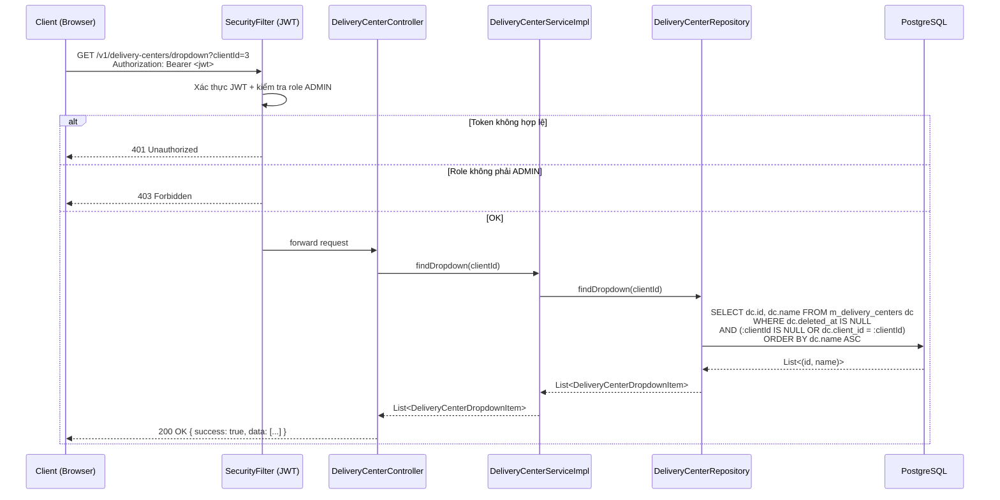

# Detail Design — M-03 Delivery Center List

## 1. Document Info

| Item | Value |
|---|---|
| Feature | Quản lý trung tâm phân phối (配送センター) — Danh sách |
| Screen ID | M-03 (list) |
| Related CUD | M-03-cud (page navigation — URL `/center/new`, `/center/{id}/edit`) |
| Source | `documents/dev-basic-design/masters/delivery-centers/delivery-centers-list/basic-design.md` |
| DB Design | `specs/db-designs/db-overview/v3/1834-db-design.dbml` |
| Common Spec | `documents/dev-basic-design/common/common-spec.md` |
| Author | tiendv@hblab.vn |
| Reviewer | (pending) |
| Created | 2026-04-22 |
| Status | Draft |

---

## 2. Overview

API trả danh sách trung tâm phân phối (配送センター) cho màn hình **M-03 — 配送センター情報管理（一覧）**. Hỗ trợ lọc AND theo `centerCode` (partial match sau trim), `clientId` / `areaId` (dropdown → FK), `centerName` (dropdown → name, exact match), sắp xếp theo 3 cột được phép (`centerCode`, `clientCode`, `areaName`), và phân trang 15 / 30 / 50 dòng/trang (mặc định 30).

**Actors:**
- ADMIN (管理者) — duy nhất được phép gọi API này (basic-design §1: "Chỉ tài khoản có vai trò 管理").

**Preconditions:**
- Người dùng đã đăng nhập, JWT còn hiệu lực.
- Role của user = `ADMIN`.

**Postconditions:**
- Trả về `Page<DeliveryCenterListResponse>` — chỉ các bản ghi `deleted_at IS NULL`.
- Không thay đổi trạng thái dữ liệu (operation read-only).

---

## 3. DB Schema

> Nguồn: DBML v3 (`specs/db-designs/db-overview/v3/1834-db-design.dbml`). Dùng **nguyên xi** — không thêm/sửa cột.

### 3.1 Table `psms.m_delivery_centers` (primary)

| Column | Type | Constraints | Notes |
|---|---|---|---|
| `id` | `BIGSERIAL` | PK | Khóa chính — dùng cho action "Sửa" (`/center/{id}/edit`) |
| `code` | `VARCHAR(50)` | NOT NULL | センターID (UI cột #9-1) — mã trung tâm (ví dụ `kakogawa`) |
| `name` | `VARCHAR(255)` | NOT NULL | Tên trung tâm (UI cột #9-5) |
| `client_id` | `BIGINT` | NOT NULL, FK → `m_clients.id` | Trung tâm thuộc client nào |
| `area_id` | `BIGINT` | NOT NULL, FK → `m_areas.id` | Trung tâm thuộc khu vực nào |
| `postal_code` | `VARCHAR(10)` | nullable | Không hiển thị ở list |
| `prefecture` | `VARCHAR(20)` | nullable | Không hiển thị ở list |
| `address` | `VARCHAR(500)` | nullable | Không hiển thị ở list |
| `phone` | `VARCHAR(20)` | nullable | Không hiển thị ở list |
| `status` | `VARCHAR(20)` | NOT NULL, DEFAULT `'ACTIVE'` | `ACTIVE` / `INACTIVE` |
| `created_at` | `TIMESTAMPTZ` | NOT NULL | — |
| `created_by` | `VARCHAR(100)` | NOT NULL | — |
| `updated_at` | `TIMESTAMPTZ` | NOT NULL | — |
| `updated_by` | `VARCHAR(100)` | NOT NULL | — |
| `deleted_at` | `TIMESTAMPTZ` | nullable | Xóa mềm — list ẩn khi có giá trị |
| `deleted_by` | `VARCHAR(100)` | nullable | — |

**Unique constraint:** `(client_id, code)` → `uq_m_delivery_center_client_code`.
**Indexes:** `idx_m_delivery_center_client_id (client_id)`, `idx_m_delivery_center_area_id (area_id)`, `idx_m_delivery_center_status (status)`.

### 3.2 Table `psms.m_clients` (JOIN — hiển thị `clientCode` + `clientName`)

| Column | Type | Role |
|---|---|---|
| `id` | `BIGSERIAL` | PK, target của FK `m_delivery_centers.client_id` |
| `code` | `VARCHAR(50)` | UNIQUE | クライアントID trên UI (cột #9-2) |
| `name` | `VARCHAR(255)` | NOT NULL | クライアント名 trên UI (cột #9-3) |
| `status` | `VARCHAR(20)` | `ACTIVE` / `INACTIVE` — không ảnh hưởng list; ảnh hưởng dropdown (xem §5.3) |
| `deleted_at` | `TIMESTAMPTZ` | Ẩn khỏi dropdown filter khi khác NULL |

### 3.3 Table `psms.m_areas` (JOIN — hiển thị `areaName` + sort)

| Column | Type | Role |
|---|---|---|
| `id` | `BIGSERIAL` | PK, target của FK `m_delivery_centers.area_id` |
| `name` | `VARCHAR(255)` | NOT NULL | エリア名 trên UI (cột #9-4) — sort target |
| `client_id` | `BIGINT` | NOT NULL, FK → `m_clients.id` | Dùng để thu hẹp dropdown area theo client đã chọn |
| `status` | `VARCHAR(20)` | `ACTIVE` / `INACTIVE` |
| `deleted_at` | `TIMESTAMPTZ` | Ẩn khỏi JOIN/dropdown khi khác NULL |

---

## 4. API Endpoints Summary

| # | Method | Path | Role | Description |
|---|---|---|---|---|
| 1 | GET | `/v1/delivery-centers` | ADMIN | Danh sách trung tâm phân phối với filter, sort, pagination |
| 2 | GET | `/v1/delivery-centers/dropdown` | ADMIN | List tối giản cho dropdown filter "tên trung tâm" (M-03 list filter #5) |

> Base path `/v1/delivery-centers` — số nhiều, kebab-case (CLAUDE.md RULE 1).

---

## 5. API Detail

### 5.1 GET /v1/delivery-centers

#### Authorization

- Security: `Bearer <JWT>` bắt buộc (header `Authorization`).
- Method-level: `@PreAuthorize("hasRole('ADMIN')")` (hoặc class-level trên `DeliveryCenterController`).
- LOGISTICS hoặc user chưa đăng nhập → 403 / 401.

#### Request

**Headers:**

| Header | Required | Value |
|---|---|---|
| `Authorization` | Yes | `Bearer <token>` |
| `Accept` | No | `application/json` |

**Query Parameters:**

| Parameter | Type | Required | Default | Description |
|---|---|---|---|---|
| `centerCode` | `String` | No | — | Filter `m_delivery_centers.code` — **trim đầu/cuối**, sau đó **partial match** (case-insensitive, `LIKE %value%`). Rỗng sau trim → bỏ qua điều kiện |
| `clientId` | `Long` | No | — | Filter `m_delivery_centers.client_id = :clientId` (chọn từ dropdown クライアント) |
| `areaId` | `Long` | No | — | Filter `m_delivery_centers.area_id = :areaId` (chọn từ dropdown エリア) |
| `centerName` | `String` | No | — | Filter `m_delivery_centers.name = :centerName` — **trim đầu/cuối**, **exact match** (case-insensitive). Giá trị do dropdown truyền (basic-design §3 #5 mapping `m_distribution_centers.name`). Rỗng sau trim → bỏ qua điều kiện |
| `page` | `int` | No | `0` | Chỉ số trang (bắt đầu 0) |
| `size` | `int` | No | `30` | Số dòng/trang — FE gửi 15 / 30 / 50 theo basic-design §5 (UI dropdown). BE không enforce whitelist — chấp nhận mọi size hợp lệ của Spring Pageable (cap theo `spring.data.web.pageable.max-page-size`) |
| `sort` | `String` | No | `centerCode,asc` | Cặp `{field},{asc\|desc}`. **Field hợp lệ:** `centerCode`, `clientCode`, `areaName` |

**Sort rules:**

- Default: `centerCode,asc` (basic-design §5 "sort mặc định theo cột ID trung tâm tăng dần" — センターID = `m_delivery_centers.code`).
- Chỉ 3 field được phép (basic-design §3 #9-1/9-2/9-4, §5):
  - `centerCode` → ORDER BY `m_delivery_centers.code`
  - `clientCode` → ORDER BY `m_clients.code` (JOIN)
  - `areaName`  → ORDER BY `m_areas.name`  (JOIN)
- Field khác (kể cả `id`, `clientName`, `name`) → 400 `PSMS-CTR-005`.
- Direction khác `asc` / `desc` → 400 `PSMS-CTR-011`.
- Tie-breaker (để pagination ổn định): `m_delivery_centers.id ASC`.

**Filter rules (basic-design §3 + §5):**

- Kết hợp bằng **AND** giữa các điều kiện có giá trị.
- `centerCode` rỗng/null sau trim → bỏ qua.
- `centerName` rỗng/null sau trim → bỏ qua.
- `clientId` / `areaId` null → bỏ qua.
- **Khi `clientId` có giá trị** (FE đã thu hẹp dropdown theo client), BE không áp thêm ràng buộc chéo — vẫn lọc độc lập để client có thể truyền tổ hợp tùy ý (basic-design §5: AND đơn giản, không ràng buộc BE).

#### Response

**200 OK** — `ApiResponse<PageResponse<DeliveryCenterListResponse>>`

```json
{
  "success": true,
  "message": null,
  "data": {
    "content": [
      {
        "id": 12,
        "code": "kakogawa",
        "name": "加古川配送センター",
        "clientId": 3,
        "clientCode": "FMART",
        "clientName": "ファミリーマート",
        "areaId": 5,
        "areaName": "関西"
      }
    ],
    "page": 0,
    "size": 30,
    "totalElements": 140,
    "totalPages": 5
  }
}
```

**Response fields:**

| Field | Type | Source | UI column | Notes |
|---|---|---|---|---|
| `id` | `Long` | `m_delivery_centers.id` | (hidden) | Dùng cho action Sửa (`/center/{id}/edit`) |
| `code` | `String` | `m_delivery_centers.code` | #9-1 センターID | — |
| `name` | `String` | `m_delivery_centers.name` | #9-5 Tên trung tâm | — |
| `clientId` | `Long` | `m_delivery_centers.client_id` | (hidden) | Dùng bởi FE khi chuyển M-03-cud |
| `clientCode` | `String` | `m_clients.code` (JOIN) | #9-2 クライアントID | Bổ sung so với DTO hiện hành — xem §13 (Gap-1) |
| `clientName` | `String` | `m_clients.name` (JOIN) | #9-3 クライアント名 | — |
| `areaId` | `Long` | `m_delivery_centers.area_id` | (hidden) | — |
| `areaName` | `String` | `m_areas.name` (JOIN) | #9-4 エリア名 | — |

> Cột `status`, `postalCode`, `prefecture`, `address`, `phone` không hiển thị ở M-03 list — giữ cho M-03-cud (chi tiết).

#### Business Logic

1. **Authorization check** — Spring Security xác thực JWT và kiểm tra role `ADMIN`. Không phải ADMIN → 401/403 qua `GlobalExceptionHandler`.
2. **Bind params** — Controller nhận `centerCode`, `clientId`, `areaId`, `centerName` qua `@RequestParam`; nhận `page`, `size`, `sort` qua `Pageable` + `@PageableDefault(size = 30, sort = "centerCode")`.
3. **Validate sort** — duyệt `pageable.getSort()`:
   - Mỗi `order.getProperty()` phải ∈ `{centerCode, clientCode, areaName}`; sai → `BusinessException(PSMS-CTR-005)` (400).
   - `order.getDirection()` phải ∈ `{ASC, DESC}`; Spring tự parse, nhưng BE vẫn assert — sai → `BusinessException(PSMS-CTR-011)` (400).
4. **Resolve sort path** — map property logic → property JPA:
   - `centerCode` → `code`
   - `clientCode` → `client.code`
   - `areaName`  → `area.name`
   - Gắn tie-breaker `id ASC` vào cuối `Sort`.
5. **Build `Specification<DeliveryCenter>`** — AND các điều kiện:
   - `deleted_at IS NULL` (bắt buộc).
   - Nếu `centerCode` có giá trị sau trim: `LOWER(code) LIKE LOWER(%:trimmed%)` (partial, case-insensitive).
   - Nếu `clientId` != null: `client.id = :clientId`.
   - Nếu `areaId` != null: `area.id = :areaId`.
   - Nếu `centerName` có giá trị sau trim: `LOWER(name) = LOWER(:trimmed)` (exact, case-insensitive).
6. **Query** — `deliveryCenterRepository.findAll(spec, resolvedPageable)`. JPA tự JOIN `m_clients` và `m_areas` khi sort đụng tới `client.code` / `area.name` hoặc khi mapper truy cập eager.
7. **Map sang DTO** — `DeliveryCenterMapper.toListResponse(DeliveryCenter)`:
   - `id` ← `entity.getId()`
   - `code` ← `entity.getCode()`
   - `name` ← `entity.getName()`
   - `clientId` ← `entity.getClient().getId()`
   - `clientCode` ← `entity.getClient().getCode()`
   - `clientName` ← `entity.getClient().getName()`
   - `areaId` ← `entity.getArea().getId()`
   - `areaName` ← `entity.getArea().getName()`
8. **Wrap** — `PageResponse.from(page)` → `ApiResponse.page(page)`.

#### Error Cases

| HTTP | Code | Message (JP) | Nguyên nhân |
|---|---|---|---|
| 400 | `PSMS-CTR-005` | `ソート項目「{0}」は使用できません` | `sort` field không ∈ whitelist `{centerCode, clientCode, areaName}` |
| 400 | `PSMS-CTR-011` | `並び替えの方向が不正です。` | `sort` direction khác `asc` / `desc` |
| 401 | — | (Spring Security default) | Thiếu/hết hạn JWT |
| 403 | — | (Spring Security default) | Role ≠ ADMIN |
| 500 | `MSG-022` | `システムエラーが発生しました。しばらくしてから再試行してください。` | DB lỗi / lỗi không kiểm soát (FE hiển thị modal theo common-spec §4.1) |

#### Sequence Diagram

```mermaid
sequenceDiagram
    participant C as Client (Browser)
    participant SEC as SecurityFilter (JWT)
    participant CTRL as DeliveryCenterController
    participant SVC as DeliveryCenterServiceImpl
    participant SPEC as DeliveryCenterSpecification
    participant REPO as DeliveryCenterRepository
    participant DB as PostgreSQL
    participant MAP as DeliveryCenterMapper

    C->>SEC: GET /v1/delivery-centers?centerCode&clientId&areaId&centerName&page&size&sort<br/>Authorization: Bearer <jwt>
    SEC->>SEC: Xác thực JWT + kiểm tra role ADMIN
    alt Token không hợp lệ / hết hạn
        SEC-->>C: 401 Unauthorized
    else Role không phải ADMIN
        SEC-->>C: 403 Forbidden
    else OK
        SEC->>CTRL: forward request
        CTRL->>CTRL: Bind params → DeliveryCenterFilterRequest + Pageable (default size=30, sort=centerCode,asc)
        CTRL->>SVC: validateSort(pageable)
        alt sort field sai
            SVC-->>CTRL: throw BusinessException(PSMS-CTR-005)
            CTRL-->>C: 400 Bad Request (ApiResponse.error)
        else sort direction sai
            SVC-->>CTRL: throw BusinessException(PSMS-CTR-011)
            CTRL-->>C: 400 Bad Request
        else OK
            CTRL->>SVC: findAll(filter, pageable)
            SVC->>SVC: resolveSort: centerCode→code, clientCode→client.code, areaName→area.name; append id ASC tie-breaker
            SVC->>SPEC: withFilters(filter)
            Note over SPEC: Predicate AND:<br/>• deleted_at IS NULL<br/>• LOWER(code) LIKE LOWER(%:trimmed%)  (nếu centerCode)<br/>• client.id = :clientId<br/>• area.id = :areaId<br/>• LOWER(name) = LOWER(:trimmed)       (nếu centerName)
            SPEC-->>SVC: Specification<DeliveryCenter>
            SVC->>REPO: findAll(spec, resolvedPageable)
            REPO->>DB: SELECT ... FROM m_delivery_centers dc<br/>LEFT JOIN m_clients c ON c.id = dc.client_id<br/>LEFT JOIN m_areas a ON a.id = dc.area_id<br/>WHERE ... ORDER BY ... LIMIT ? OFFSET ?
            DB-->>REPO: Page<DeliveryCenter> (eager client, area qua sort)
            REPO-->>SVC: Page<DeliveryCenter>
            SVC->>MAP: page.map(toListResponse)
            MAP-->>SVC: Page<DeliveryCenterListResponse>
            SVC-->>CTRL: Page<DeliveryCenterListResponse>
            CTRL->>CTRL: PageResponse.from(page) → ApiResponse.page(page)
            CTRL-->>C: 200 OK { success: true, data: PageResponse }
        end
    end
```

### 5.2 GET /v1/delivery-centers/dropdown

Dùng để nạp **dropdown filter "tên trung tâm"** trên chính màn M-03 list (basic-design §3 #5). Response tối giản, không pagination, không sort tùy biến.

#### Authorization

- Security: `Bearer <JWT>` bắt buộc.
- Class-level: `@PreAuthorize("hasRole('ADMIN')")` — kế thừa từ `DeliveryCenterController`.
- LOGISTICS / user chưa đăng nhập → 403 / 401.

#### Request

**Headers:**

| Header | Required | Value |
|---|---|---|
| `Authorization` | Yes | `Bearer <token>` |
| `Accept` | No | `application/json` |

**Query Parameters:**

| Parameter | Type | Required | Default | Description |
|---|---|---|---|---|
| `clientId` | `Long` | No | — | Nếu truyền → thu hẹp theo client (basic-design §3 #5: "Khi đã chọn khách hàng: dropdown được **thu hẹp theo khách hàng**"). Null → trả toàn bộ center (trừ soft-deleted). |

#### Response — 200 OK

`ApiResponse<List<DeliveryCenterDropdownItem>>`

```json
{
  "success": true,
  "message": null,
  "data": [
    { "id": 12, "name": "加古川配送センター" },
    { "id": 15, "name": "神戸配送センター" },
    { "id": 18, "name": "大阪配送センター" }
  ]
}
```

**Response fields (per item):**

| Field | Type | Source | Notes |
|---|---|---|---|
| `id` | `Long` | `m_delivery_centers.id` | Dùng làm key khi FE render `<option value="id">` — tuy nhiên, filter param main API là `centerName` (String) nên FE sẽ gửi `name` khi user chọn; `id` chỉ để de-dup nếu cần |
| `name` | `String` | `m_delivery_centers.name` | Hiển thị text trong dropdown |

> **Không có:** `code`, `clientId`, `areaId`, `status` — dropdown không cần.

#### Business Logic

1. **Authorization check** — Spring Security xác thực JWT + role `ADMIN`.
2. **Bind param** — `clientId` tùy chọn.
3. **Query** — gọi `deliveryCenterRepository.findDropdown(clientId)`:
   - WHERE `deleted_at IS NULL` (luôn ẩn soft-deleted).
   - AND (`:clientId IS NULL` OR `client_id = :clientId`) (lọc theo client nếu có).
   - **Không filter theo `status`** — common-spec §5.6 "Màn danh sách pulldown hiển thị cả INACTIVE (停止)".
   - ORDER BY `name ASC`.
4. **Wrap** — trả `ApiResponse.ok(list)`.

#### Error Cases

| HTTP | Code | Message (JP) | Nguyên nhân |
|---|---|---|---|
| 401 | — | (Spring Security default) | Thiếu/hết hạn JWT |
| 403 | — | (Spring Security default) | Role ≠ ADMIN |
| 500 | `MSG-022` | `システムエラーが発生しました。しばらくしてから再試行してください。` | DB lỗi / lỗi không kiểm soát |

#### Sequence Diagram



#### Testing Scenarios

| # | Scenario | Input | Expected |
|---|---|---|---|
| GD-01 | Không `clientId` | `GET /v1/delivery-centers/dropdown` | 200, trả tất cả center `deleted_at IS NULL` (cả ACTIVE + INACTIVE), ORDER BY name ASC |
| GD-02 | Có `clientId` | `?clientId=3` | 200, chỉ center thuộc client 3, ORDER BY name ASC |
| GD-03 | `clientId` trỏ đến client đã xóa | `?clientId=999` | 200, `data=[]` (FK không khớp) |
| GD-04 | Center INACTIVE | — | 200, vẫn hiển thị (common-spec §5.6) |
| GD-05 | Center soft-deleted | — | 200, không hiển thị |
| XD-01 | Thiếu JWT | no Authorization | 401 |
| XD-02 | Role LOGISTICS | LOGISTICS token | 403 |

---

## 6. DTO Definitions

### 6.1 Request — Query param binding

```java
// jp.kreo.psms.dto.request.DeliveryCenterFilterRequest
public record DeliveryCenterFilterRequest(
    String centerCode,   // partial match after trim (lower-case, LIKE %...%)
    Long   clientId,
    Long   areaId,
    String centerName    // exact match after trim (basic-design §3 #5 — dropdown trả m_delivery_centers.name)
) {
    public static DeliveryCenterFilterRequest empty() {
        return new DeliveryCenterFilterRequest(null, null, null, null);
    }
}
```

> `page`, `size`, `sort` được Spring bind qua `Pageable` (không đưa vào DTO).
> DTO hiện trong repo đã khớp — không cần đổi.

### 6.2 Response — Item

```java
// jp.kreo.psms.dto.response.DeliveryCenterListResponse
public record DeliveryCenterListResponse(
    Long   id,
    String code,
    String name,
    Long   clientId,
    String clientCode,
    String clientName,
    Long   areaId,
    String areaName
) { }
```

> Xem §16 Gap-1: DTO hiện trong repo thiếu `clientCode`. Cần thêm field + cập nhật MapStruct mapper.

### 6.3 Response — Dropdown Item

```java
// jp.kreo.psms.dto.response.DeliveryCenterDropdownItem
public record DeliveryCenterDropdownItem(
    Long   id,
    String name
) { }
```

### 6.4 Standard wrappers (đã có sẵn)

```java
// jp.kreo.psms.dto.response.ApiResponse<T>     — wrapper chuẩn dự án
// jp.kreo.psms.dto.response.PageResponse<T>    — chuẩn hóa Page
```

---

## 7. Service Contract

```java
// jp.kreo.psms.service.DeliveryCenterService
public interface DeliveryCenterService {
    /**
     * Trả về danh sách delivery center chưa xóa mềm.
     * @throws BusinessException PSMS-CTR-005 nếu sort field không hợp lệ
     * @throws BusinessException PSMS-CTR-011 nếu sort direction không hợp lệ
     */
    Page<DeliveryCenterListResponse> findAll(DeliveryCenterFilterRequest filter, Pageable pageable);

    /** Danh sách tối giản cho dropdown filter (M-03 §5.2). */
    List<DeliveryCenterDropdownItem> findDropdown(Long clientId);

    void validateSort(Pageable pageable);
    // ... các method khác (findById, create, update, delete) — khác scope
}
```

---

## 8. Repository / Specification

### 8.1 Repository

```java
// jp.kreo.psms.repository.DeliveryCenterRepository
public interface DeliveryCenterRepository
        extends JpaRepository<DeliveryCenter, Long>,
                JpaSpecificationExecutor<DeliveryCenter> {

    @EntityGraph(attributePaths = {"client", "area"})
    Page<DeliveryCenter> findAll(Specification<DeliveryCenter> spec, Pageable pageable);

    /**
     * Dropdown query — tối giản, không pagination, không JOIN client/area vì response chỉ cần (id, name).
     * clientId null → không filter theo client.
     */
    @Query("""
            SELECT new jp.kreo.psms.dto.response.DeliveryCenterDropdownItem(dc.id, dc.name)
            FROM DeliveryCenter dc
            WHERE dc.deletedAt IS NULL
              AND (:clientId IS NULL OR dc.client.id = :clientId)
            ORDER BY dc.name ASC
            """)
    List<DeliveryCenterDropdownItem> findDropdown(@Param("clientId") Long clientId);
}
```

### 8.2 Specification (partial match + AND)

```java
// jp.kreo.psms.repository.DeliveryCenterSpecification
public static Specification<DeliveryCenter> withFilters(DeliveryCenterFilterRequest filter) {
    Specification<DeliveryCenter> spec = notDeleted();                    // deleted_at IS NULL

    if (StringUtils.hasText(filter.centerCode())) {
        spec = spec.and(codeLike(filter.centerCode()));                   // LOWER(code) LIKE %:trim%
    }
    if (filter.clientId() != null) {
        spec = spec.and((root, q, cb) -> cb.equal(root.get("client").get("id"), filter.clientId()));
    }
    if (filter.areaId() != null) {
        spec = spec.and((root, q, cb) -> cb.equal(root.get("area").get("id"), filter.areaId()));
    }
    if (StringUtils.hasText(filter.centerName())) {
        String trimmed = filter.centerName().trim().toLowerCase();
        spec = spec.and((root, q, cb) -> cb.equal(cb.lower(root.get("name")), trimmed));
    }
    return spec;
}
```

---

## 9. Controller Signature

```java
// jp.kreo.psms.controller.DeliveryCenterController
@GetMapping
@Operation(summary = "List delivery centers with filter, sort, and pagination")
public ApiResponse<PageResponse<DeliveryCenterListResponse>> findAll(
        @RequestParam(required = false) String centerCode,
        @RequestParam(required = false) Long clientId,
        @RequestParam(required = false) Long areaId,
        @RequestParam(required = false) String centerName,
        @PageableDefault(size = 30, sort = "centerCode", direction = Sort.Direction.ASC) Pageable pageable) {

    deliveryCenterService.validateSort(pageable);
    DeliveryCenterFilterRequest filter =
            new DeliveryCenterFilterRequest(centerCode, clientId, areaId, centerName);
    return ApiResponse.page(deliveryCenterService.findAll(filter, pageable));
}

@GetMapping("/dropdown")
@Operation(summary = "List delivery centers for dropdown filter")
public ApiResponse<List<DeliveryCenterDropdownItem>> dropdown(
        @RequestParam(required = false) Long clientId) {
    return ApiResponse.ok(deliveryCenterService.findDropdown(clientId));
}
```

---

## 10. Mapper

```java
// jp.kreo.psms.mapper.DeliveryCenterMapper  (MapStruct)
@Mapper(componentModel = "spring")
public interface DeliveryCenterMapper {

    @Mapping(target = "clientId",   source = "client.id")
    @Mapping(target = "clientCode", source = "client.code")
    @Mapping(target = "clientName", source = "client.name")
    @Mapping(target = "areaId",     source = "area.id")
    @Mapping(target = "areaName",   source = "area.name")
    DeliveryCenterListResponse toListResponse(DeliveryCenter entity);

    // ... toResponse(...) cho chi tiết — khác scope
}
```

---

## 11. Error Handling Summary

| Error Code | HTTP | Exception | Where thrown |
|---|---|---|---|
| `PSMS-CTR-005` | 400 | `BusinessException` | `DeliveryCenterServiceImpl#validateSort` — sort field không hợp lệ |
| `PSMS-CTR-011` | 400 | `BusinessException` | `DeliveryCenterServiceImpl#validateSort` — sort direction không hợp lệ |
| `MSG-022` | 500 | `Exception` (fallback) | `GlobalExceptionHandler#handleGeneral` |

> `PSMS-CTR-011` là mã mới cho feature này — đã bổ sung vào `MessageCode.java` + `messages_ja.properties`.

**Retry policy:**

| Status | Retry | Ghi chú |
|---|---|---|
| 400 | No | Client sửa input rồi gọi lại |
| 401 | Sau khi refresh token | FE tự refresh hoặc chuyển về `/login` |
| 403 | No | User không đủ quyền |
| 500 | Có, exponential backoff | FE hiển thị modal lỗi kết nối theo common-spec §4.1 (MSG-022) |

---

## 12. Testing Scenarios

### 12.1 Happy Path

| # | Scenario | Input | Expected |
|---|---|---|---|
| G-01 | Không filter, default sort/size | `GET /v1/delivery-centers` | 200, `sort=centerCode,asc`, page 0, size 30, chỉ center `deleted_at IS NULL` |
| G-02 | Partial match `centerCode` | `centerCode=kako` | 200, trả tất cả có `code LIKE %kako%` (case-insensitive) |
| G-03 | Filter `clientId` | `clientId=3` | 200, chỉ center thuộc client 3 |
| G-04 | Filter `areaId` | `areaId=5` | 200, chỉ center thuộc area 5 |
| G-05 | Filter `centerName` exact | `centerName=加古川配送センター` | 200, chỉ center có `name='加古川配送センター'` |
| G-06 | Combine filter | `clientId=3&areaId=5` | 200, AND logic |
| G-07 | Sort `clientCode,desc` | `sort=clientCode,desc` | 200, ORDER BY `m_clients.code DESC, id ASC` |
| G-08 | Sort `areaName,asc` | `sort=areaName,asc` | 200, ORDER BY `m_areas.name ASC, id ASC` |
| G-09 | Pagination size 15 | `size=15&page=1` | 200, page 2, 15 items |
| G-10 | Pagination size 50 | `size=50` | 200, 50 items/trang |
| G-11 | Không có kết quả | `centerCode=ZZZZ` | 200, `content=[]`, `totalElements=0`, `totalPages=0` |

### 12.2 Edge Cases

| # | Scenario | Input | Expected |
|---|---|---|---|
| E-01 | `centerCode` có whitespace 2 đầu | `centerCode=  kako  ` | 200, trim rồi `LIKE %kako%` |
| E-02 | `centerCode` rỗng sau trim | `centerCode=   ` | 200, bỏ qua điều kiện |
| E-03 | `centerCode` case khác | `centerCode=KAKO` | 200, case-insensitive match `kako` |
| E-04 | Center status INACTIVE | — | 200, vẫn hiển thị (chỉ ẩn soft-deleted) |
| E-05 | Center đã xóa mềm | — | 200, không hiển thị |
| E-06 | `clientId` trỏ đến client đã xóa | `clientId=999` | 200, `content=[]` (FK không match bản ghi active) |
| E-07 | `centerName` có whitespace 2 đầu | `centerName=  加古川配送センター  ` | 200, trim rồi exact match |
| E-08 | `centerName` rỗng sau trim | `centerName=   ` | 200, bỏ qua điều kiện |
| E-09 | `centerName` không khớp chính xác (partial) | `centerName=加古川` | 200, `content=[]` (exact match, không partial) |
| E-10 | Page vượt quá tổng trang | `page=99` | 200, `content=[]`, `totalElements` không đổi |

### 12.3 Error Cases

| # | Scenario | Input | Expected |
|---|---|---|---|
| X-01 | Thiếu JWT | không có `Authorization` | 401 |
| X-02 | JWT hết hạn | expired token | 401 |
| X-03 | Role LOGISTICS | LOGISTICS token | 403 |
| X-04 | Sort field không hợp lệ | `sort=id,asc` | 400, `PSMS-CTR-005` |
| X-05 | Sort field là `clientName` | `sort=clientName,asc` | 400, `PSMS-CTR-005` (UI cột #9-3 không cho sort) |
| X-06 | Sort field là `name` | `sort=name,asc` | 400, `PSMS-CTR-005` (UI cột #9-5 không cho sort) |
| X-07 | Sort direction sai | `sort=centerCode,up` | 400, `PSMS-CTR-011` |

---

## 13. Dependent APIs (Dropdown Sources)

Màn M-03 list cần 3 API master để nạp dropdown filter (basic-design §3 #3/#4/#5). Các API này **thuộc feature khác** — detail-design này chỉ tham chiếu, không định nghĩa lại.

### 13.1 Dropdown rules (theo basic-design + common-spec §5.6)

| Dropdown | Nguồn | Ẩn `deleted_at IS NOT NULL`? | Hiển thị `INACTIVE` (停止)? | Thu hẹp theo client? |
|---|---|---|---|---|
| `clientId` (クライアント名) | `m_clients` | ✅ Có | ✅ Có | — |
| `areaId` (エリア名) | `m_areas` | ✅ Có | ✅ Có | ✅ Khi `clientId` đã chọn |
| `centerName` (センター名) | `m_delivery_centers` | ✅ Có | ✅ Có | ✅ Khi `clientId` đã chọn |

> common-spec §5.6 — "Màn hình danh sách (List): tại pulldown điều kiện lọc, cho phép hiển thị các đối tượng đang tạm dừng". Luôn ẩn soft-deleted.

### 13.2 Expected endpoints (tham chiếu)

| # | Method | Path | Feature chứa | Query param bổ sung | Response hình dung |
|---|---|---|---|---|---|
| D-1 | GET | `/v1/clients/dropdown` | M-01 Client | — | `[{ id, code, name }]` — cả ACTIVE + INACTIVE, `deleted_at IS NULL` |
| D-2 | GET | `/v1/areas/dropdown?clientId={id}` | M-02 Area | `clientId` (optional) | `[{ id, name }]` — lọc theo client nếu có, ẩn soft-deleted |
| D-3 | GET | `/v1/delivery-centers/dropdown?clientId={id}` | **Feature này — xem §5.2** | `clientId` (optional) | `[{ id, name }]` — ẩn soft-deleted |

> Hiện trạng: D-3 đã được định nghĩa đầy đủ ở §5.2 và sẽ được gen ở Phase 3 Batch 2. D-1, D-2 thuộc feature khác (clients-list / areas-list) — ngoài scope.

### 13.3 Cascading behavior

- `clientId` thay đổi → FE reset `areaId`, `centerName`, sau đó gọi lại D-2 và D-3 với `clientId` mới.
- `clientId` clear (về null) → FE gọi D-2, D-3 không truyền `clientId` (dropdown full theo master).
- BE các endpoint D-2 / D-3 **không** tự động infer `clientId` từ context — luôn dựa trên query param.

---

## 14. FE Behavior Contract

Các hành vi FE phải tuân thủ khi gọi API list này (basic-design §4 + common-spec §3):

| # | Sự kiện | Hành vi FE (query param) |
|---|---|---|
| F-01 | Initial load | `GET /v1/delivery-centers?page=0&size=30&sort=centerCode,asc` — không gửi filter (basic-design §4 "chưa áp dụng lọc cho đến khi người dùng kích hoạt") |
| F-02 | User click "Tìm / Lọc" | Gửi các filter param có giá trị, **reset `page=0`**, giữ `sort` hiện tại |
| F-03 | User click header cột sort | **Reset `page=0`**, giữ filter, đổi `sort={field},{asc|desc}` (cycle: asc → desc → không sort về default) |
| F-04 | User đổi trang | Giữ nguyên filter + sort, chỉ đổi `page` |
| F-05 | User đổi page size (15/30/50) | **Reset `page=0`**, giữ filter + sort, đổi `size` |
| F-06 | User xóa hết filter → "Tìm" | Gọi lại không kèm filter, `page=0`, giữ `sort` |
| F-07 | Quay lại M-03 sau khi Create/Update/Delete ở M-03-cud | Reload với filter + sort + page trước đó (FE tự cache) hoặc mặc định F-01 |

**Pagination visibility:**

- Hiển thị điều khiển phân trang **chỉ khi** `totalPages >= 2` (basic-design §2 #5).
- Khi `totalPages === 1` hoặc `totalElements === 0`: ẩn điều khiển phân trang.

**Error UX:**

- 400 (validation) → toast đỏ với message từ `ApiResponse.message`, prefix `[CODE]` theo common-spec §5.7 (ví dụ `[PSMS-CTR-005] 並び替えの項目が不正です。`).
- 401/403 → FE redirect `/login` hoặc show "Không đủ quyền".
- 500 → modal lỗi kết nối theo common-spec §4.1 (MSG-022).
- Empty result → empty state với hướng dẫn "新規作成" (common-spec §4) — button link tới `/center/new`.

---

## 15. Non-Functional Requirements

| NFR | Target | Source |
|---|---|---|
| Thời gian tải 1 trang danh sách | **< 3 giây** (p95) | basic-design §5 "Yêu cầu phi chức năng" |
| Concurrent users | Chưa xác định — giả định ≤ 50 concurrent ADMIN | Assumption |
| DB index sử dụng | `idx_m_delivery_center_client_id`, `idx_m_delivery_center_area_id` — match filter `clientId` / `areaId` | DBML v3 |
| N+1 risk | Chấp nhận LAZY fetch cho `client` / `area` vì max 50 record/trang → tối đa 100 extra query/page. Nếu profiling cho thấy > 200ms overhead → apply `@EntityGraph(attributePaths = {"client", "area"})` trên `findAll(Specification, Pageable)` | — |
| Query timeout | Dùng default của HikariCP (`validation-timeout: 5000ms`) — nếu quá → 500 + retry theo common-spec §4.1 | `.claude/rules/database.md` |

---

## 16. Notes & Assumptions

1. **Filter `centerCode` partial match** (basic-design §3 #2 "khớp một phần / contains"). Khác với areas-list (`areaCode` exact match) — điều này là chủ ý per spec của từng màn.
2. **Dropdown filter value theo basic-design §3 #3/#4/#5**:
   - `clientId` / `areaId`: dropdown → value = **id** (Long FK) — pattern chuẩn cho master có `id` dropdown.
   - `centerName`: dropdown → value = **name** (String exact match) — basic-design §3 #5 ánh xạ rõ `m_distribution_centers.name`. BE match case-insensitive, trim trước khi so.
3. **Sort chỉ 3 cột** (basic-design §5): `centerCode` (センターID), `clientCode` (クライアントID), `areaName` (エリア名). UI không hiển thị icon sort trên `clientName` (#9-3) và `name` (#9-5) — FE chặn; BE cũng reject nếu client bypass.
4. **Sort mặc định `centerCode,asc`** — basic-design §5 "ID trung tâm tăng dần". センターID = `m_delivery_centers.code` (mã business), không phải `id` (PK).
5. **Tie-breaker `id ASC`** để đảm bảo pagination ổn định (common-spec §5.4.2 nói "thời gian tạo → ID giảm dần"; ở DB-level ta dùng `id ASC` để stable và phù hợp pattern areas-list).
6. **Page size default 30** — theo basic-design §5 + common-spec §3 "Table". FE UI chỉ hiển thị option 15/30/50; BE không enforce whitelist (chấp nhận mọi size Pageable hợp lệ) để giữ flexible cho tương lai.
7. **`status` không lọc** — basic-design không yêu cầu filter theo status ở list. INACTIVE vẫn hiển thị (common-spec §5.6 cho phép).
8. **Không kiểm tra chéo `clientId` ↔ `areaId` ↔ `centerName`**: FE đảm bảo thu hẹp dropdown theo client, nhưng BE vẫn trả kết quả theo filter thô (AND). Nếu user bypass FE và gửi `clientId=3&areaId=99` trong đó area 99 thuộc client khác → trả `[]` (0 match) — không throw error.
9. **JOIN `m_clients` / `m_areas` qua `@ManyToOne(LAZY)`**: khi mapper access `getClient().getCode()` / `getArea().getName()`, Hibernate sẽ fetch. Để tránh N+1, có thể cân nhắc `@EntityGraph` trên repository method hoặc JPQL `JOIN FETCH` tùy profiling. Trong scope M-03 (dưới 1000 center/trang = 50), N+1 không critical; để mặc định LAZY.
10. **Gaps so với code hiện có trong repo** (phát hiện khi đọc `src/main/java/jp/kreo/psms`):
    - **Gap-1:** `DeliveryCenterListResponse` thiếu `clientCode` → cần thêm field + cập nhật mapper.
    - **Gap-2:** `DeliveryCenterController` đang `@PageableDefault(size = 50, sort = "id")` → đổi thành `size = 30, sort = "centerCode"`.
    - **Gap-3:** `DeliveryCenterServiceImpl.ALLOWED_SORT_FIELDS = {id, centerCode, clientName, areaName}` → đổi thành `{centerCode, clientCode, areaName}`. Bỏ `id` và `clientName`; thêm `clientCode`.
    - **Gap-4:** `resolveSort` phải map `clientCode → client.code` (hiện không có case này, chỉ map `clientName → client.name`).
    - **Gap-5:** Bổ sung `MessageCode.PSMS_CTR_011` (sort direction).
    - **Gap-6:** Endpoint `GET /v1/delivery-centers/dropdown?clientId=...` (§5.2) — FE dùng để nạp dropdown filter "tên trung tâm".
    - `DeliveryCenterFilterRequest(centerCode, clientId, areaId, centerName)` và `DeliveryCenterSpecification.byCenterName` hiện đã khớp basic-design — giữ nguyên.
    - **Các gap này sẽ được xử lý ở Phase 3 bởi `/analyze-code-gaps` + `/gen-code` (OUTDATED).**
11. **Không có xóa trực tiếp từ màn list** — basic-design §5 ("Xóa"): thao tác xóa thực hiện trên M-03-cud (màn edit). M-03 list chỉ cung cấp button "Sửa" điều hướng sang.

---

**Lịch sử phiên bản**

| Version | Date | Author | Description |
|---|---|---|---|
| 1.0 | 2026-04-22 | tiendv@hblab.vn | Initial detail-design từ basic-design M-03 + DBML v3 + common-spec |
| 1.1 | 2026-04-22 | tiendv@hblab.vn | Đổi filter `centerId` → `centerName` theo basic-design §3 #5 (Q1 chốt) |
| 1.2 | 2026-04-22 | tiendv@hblab.vn | Thêm §13 Dependent APIs (dropdown), §14 FE Behavior Contract, §15 NFR; thêm Gap-7 (dropdown endpoint) |
| 1.3 | 2026-04-22 | tiendv@hblab.vn | Bỏ validation `size ∈ {15,30,50}` và `PSMS_CTR_012` (BE không enforce); mở rộng §5.2 thành full API Detail cho `GET /v1/delivery-centers/dropdown` (Batch 2 Gap-7); thêm DTO `DeliveryCenterDropdownItem` |
