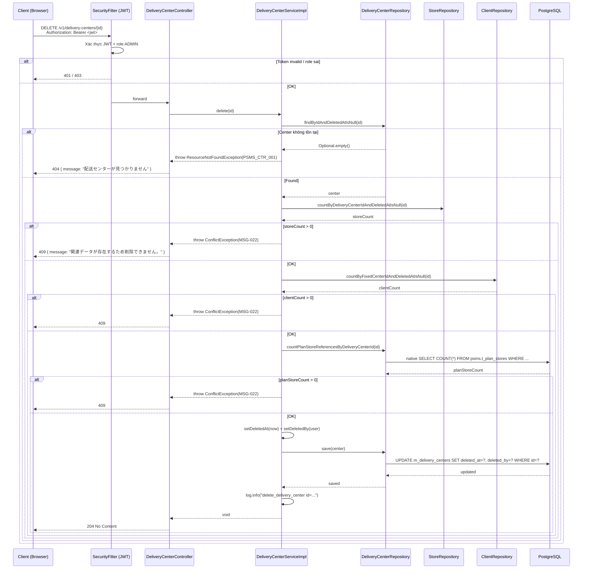

# Detail Design — M-03-delete Delivery Center Delete

## 1. Document Info

| Item | Value |
|---|---|
| Feature | Trung tâm phân phối (配送センター) — Xóa mềm |
| Screen ID | M-03-delete (thao tác từ M-03-update `/center/{id}/edit`) |
| Related | M-03 list (`/center`), M-03-cud update, M-03-cud create |
| Source | `documents/dev-basic-design/masters/delivery-centers/delivery-centers-delete/basic-design.md` |
| DB Design | `specs/db-designs/db-overview/v3/1834-db-design.dbml` (post-V10) |
| Common Spec | `documents/dev-basic-design/common/common-spec.md` |
| Message Definition | `documents/dev-basic-design/common/message-definition.md` |
| Author | tiendv@hblab.vn |
| Reviewer | (pending) |
| Created | 2026-04-22 |
| Status | Draft |

---

## 2. Overview

API cho phép ADMIN thực hiện **xóa mềm** (論理削除) bản ghi `m_delivery_centers` sau khi user xác nhận trên dialog (BD §2). BE kiểm tra **ràng buộc tham chiếu** trước khi set `deleted_at` — nếu còn bản ghi nào đang trỏ tới center này (via `m_clients.fixed_center_id` khi `destination_type = FIXED_CENTER`, hoặc `m_stores.delivery_center_id`) thì **từ chối xóa** và trả lỗi `MSG-022`. Thành công → 204 No Content; FE redirect về M-03 list.

**Actors:**
- ADMIN (管理者) — duy nhất được phép gọi API này (BD §5 "Authorization").

**Preconditions:**
- Người dùng đã đăng nhập, JWT còn hiệu lực.
- Role = `ADMIN`.
- Record `id` tồn tại và chưa bị xóa mềm (`deleted_at IS NULL`).
- User đã xác nhận trên confirmation dialog tại FE (FE responsibility).

**Postconditions:**
- Nếu không còn tham chiếu → `deleted_at = now()`, `deleted_by = <user>`. Bản ghi ẩn khỏi M-03 list + dropdown master.
- Nếu còn tham chiếu → không thay đổi `deleted_at`; trả 409 `MSG-022`.
- Log: `delete_delivery_center id={}`.

---

## 3. DB Schema

### 3.1 Target Table `psms.m_delivery_centers` (UPDATE `deleted_at` + `deleted_by`)

| Column | Type | Update behavior |
|---|---|---|
| `deleted_at` | `TIMESTAMPTZ` | `NOW()` — đánh dấu đã xóa mềm |
| `deleted_by` | `VARCHAR(100)` | `Authentication.name` — user thực hiện |
| Tất cả các cột khác | — | Không thay đổi (code, name, addresses, audit cols) |

### 3.2 Reference Check Tables (BẮT BUỘC trước delete)

Theo BD §5 "Reference Check":

| # | Table | Condition | Error nếu COUNT > 0 |
|---|---|---|---|
| 1 | `psms.m_clients` | `fixed_center_id = {id}` AND `destination_type = 'FIXED_CENTER'` AND `deleted_at IS NULL` | 409 `MSG-022` |
| 2 | `psms.m_stores` | `delivery_center_id = {id}` AND `deleted_at IS NULL` | 409 `MSG-022` |

> **BD silent về `t_plan_stores`** — code hiện tại có check thêm. Theo rule "BD silent → giữ code cũ" → giữ check này (defensive). Xem §15 Gap-2.

**Schema constraints tham gia:**

```sql
-- psms.m_clients (từ V1 schema)
fixed_center_id BIGINT NULL,  -- FK DEFERRABLE INITIALLY DEFERRED → m_delivery_centers.id
destination_type VARCHAR(20) NOT NULL DEFAULT 'EACH_CENTER'
  -- enum: EACH_CENTER | EACH_STORE | FIXED_CENTER

-- psms.m_stores (từ V1 schema)
delivery_center_id BIGINT NOT NULL,  -- FK → m_delivery_centers.id (default center)

-- psms.t_plan_stores (from V1)
delivery_center_id BIGINT NULL  -- override center per plan (có thể NULL)
```

---

## 4. API Endpoints Summary

| # | Method | Path | Role | Description |
|---|---|---|---|---|
| 1 | DELETE | `/v1/delivery-centers/{id}` | ADMIN | Xóa mềm trung tâm phân phối sau khi check references |

---

## 5. API Detail

### 5.1 DELETE /v1/delivery-centers/{id}

#### Authorization

- Security: `Bearer <JWT>` bắt buộc.
- Class-level: `@PreAuthorize("hasRole('ADMIN')")` trên `DeliveryCenterController`.
- LOGISTICS / user chưa đăng nhập → 403 / 401.

#### Request

**Headers:**

| Header | Required | Value |
|---|---|---|
| `Authorization` | Yes | `Bearer <token>` |

**Path Param:**

| Param | Type | Description |
|---|---|---|
| `id` | `Long` | PK của record cần xóa mềm |

**Không có Request Body.**

#### Response

**204 No Content** — xóa thành công, response body rỗng.

```
HTTP/1.1 204 No Content
```

> Không dùng `ApiResponse<Void>` để tiết kiệm payload; 204 standard cho DELETE. Spring `@ResponseStatus(HttpStatus.NO_CONTENT)` trên method controller.

#### Business Logic

1. **Authorization check** — Spring Security xác thực JWT + role `ADMIN`. Fail → 401/403.
2. **Load record hiện tại** — `deliveryCenterRepository.findByIdAndDeletedAtIsNull(id)`:
   - Không tìm thấy → `ResourceNotFoundException(PSMS_CTR_001)` (404).
3. **Check reference 1 — `m_stores` (store mặc định)**:
   - `storeRepository.countByDeliveryCenterIdAndDeletedAtIsNull(id)` > 0 → `ConflictException(MSG-022)` (409).
   - Catch `DataAccessException`: nếu table chưa tồn tại trong DB (early development) → log warning + skip. Pattern defensive đã có trong code hiện hành.
4. **Check reference 2 — `m_clients` (fixed_center)**:
   - `clientRepository.countByFixedCenterIdAndDeletedAtIsNull(id)` > 0 → `ConflictException(MSG-022)` (409).
   - BD §5 chỉ định thêm điều kiện `destination_type = 'FIXED_CENTER'`. Query hiện tại có thể không phân biệt → xem §15 Gap-3.
5. **Check reference 3 — `t_plan_stores` (override center)**:
   - `deliveryCenterRepository.countPlanStoreReferencesByDeliveryCenterId(id)` > 0 → `ConflictException(MSG-022)` (409).
   - Catch `DataAccessException`: skip nếu table chưa migrated.
   - BD silent về check này, giữ theo code hiện hành.
6. **Apply soft delete**:
   - `center.setDeletedAt(ZonedDateTime.now(clock))`.
   - `center.setDeletedBy(Authentication.name)` từ `SecurityContextHolder`.
7. **Save** — `deliveryCenterRepository.save(center)`. JPA auditing fields (`updated_at`, `updated_by`) tự cập nhật.
8. **Log info** — `log.info("delete_delivery_center id={}", id)`.
9. **Return** — Controller trả HTTP 204 No Content (empty body).

#### Error Cases

| HTTP | Code | Message (JP) | Nguyên nhân |
|---|---|---|---|
| 401 | — | (Spring Security default) | Thiếu/hết hạn JWT |
| 403 | — | (Spring Security default) | Role ≠ ADMIN |
| 404 | `PSMS_CTR_001` | `配送センターが見つかりません` | Center `id` không tồn tại hoặc đã xóa mềm |
| 409 | `MSG-022` | `関連データが存在するため削除できません。` | Bất kỳ check reference (1/2/3) trả COUNT > 0 |
| 500 | — | `システムエラーが発生しました。` | DB lỗi / lỗi không kiểm soát |

> **BD §5 chỉ định 1 code duy nhất `MSG-022`** cho mọi loại reference violation. Không phân biệt store / client / plan_store. Message là common template `関連データが存在するため削除できません。` — không có parameter `{項目名}`.

#### Sequence Diagram



---

## 6. Service Contract

```java
// jp.kreo.psms.service.DeliveryCenterService (đã có)
public interface DeliveryCenterService {
    /**
     * Xóa mềm delivery center sau khi check references.
     * @throws ResourceNotFoundException PSMS_CTR_001 nếu center không tồn tại
     * @throws ConflictException MSG-022 nếu có bản ghi tham chiếu (m_stores, m_clients.fixed_center, t_plan_stores)
     */
    void delete(Long id);
    // ... các method khác — khác scope
}
```

---

## 7. Repository Methods Used

```java
// jp.kreo.psms.repository.DeliveryCenterRepository (đã có)
Optional<DeliveryCenter> findByIdAndDeletedAtIsNull(Long id);
// save(entity) ← inherited

@Query(value = "SELECT COUNT(*) FROM psms.t_plan_stores ps "
             + "WHERE ps.delivery_center_id = :deliveryCenterId "
             + "AND ps.deleted_at IS NULL",
       nativeQuery = true)
long countPlanStoreReferencesByDeliveryCenterId(@Param("deliveryCenterId") Long id);

// jp.kreo.psms.repository.StoreRepository (đã có)
long countByDeliveryCenterIdAndDeletedAtIsNull(Long deliveryCenterId);

// jp.kreo.psms.repository.ClientRepository (đã có)
long countByFixedCenterIdAndDeletedAtIsNull(Long deliveryCenterId);
```

> `ClientRepository#countByFixedCenterIdAndDeletedAtIsNull` hiện **không check** `destination_type = 'FIXED_CENTER'`. Xem §15 Gap-3.

---

## 8. Controller Signature

```java
// jp.kreo.psms.controller.DeliveryCenterController (đã có)
@DeleteMapping("/{id}")
@ResponseStatus(HttpStatus.NO_CONTENT)
@Operation(summary = "Soft-delete a delivery center")
public void delete(@PathVariable Long id) {
    deliveryCenterService.delete(id);
}
```

> Class-level `@PreAuthorize("hasRole('ADMIN')")` kế thừa.

---

## 9. Error Handling Summary

| Error Code | HTTP | Exception | Where thrown |
|---|---|---|---|
| `PSMS_CTR_001` | 404 | `ResourceNotFoundException` | `DeliveryCenterServiceImpl#delete` — không tìm thấy center |
| `MSG-022` | 409 | `ConflictException` | 3 reference checks trong `#delete` (store / client fixed_center / plan_store) |
| `500` | 500 | `Exception` (fallback) | `GlobalExceptionHandler#handleGeneral` |

> **Infrastructure verified:**
> - `MessageCode.MSG_022` đã có trong enum (line 7)
> - `messages_ja.properties:24` đã có: `MSG-022=関連データが存在するため削除できません。`

**Error UX mapping (BD §5):**

| Status | UX hiển thị | Source |
|---|---|---|
| 404 | Toast đỏ + redirect về M-03 | "record không tồn tại → quay list" |
| 409 `MSG-022` | **Toast đỏ hoặc inline trên dialog/form** | BD §5 "Còn tham chiếu(MSG-022): toast(đỏ) hoặc inline" |
| 500 | Modal common-spec §4.1 | — |

---

## 10. Testing Scenarios

### 10.1 Happy Path

| # | Scenario | Input | Expected |
|---|---|---|---|
| G-01 | Delete center không có reference | `DELETE /v1/delivery-centers/5` với id 5 không có store/client/plan tham chiếu | 204 No Content; DB: `deleted_at != NULL`, `deleted_by = <user>` |
| G-02 | Delete center sau khi store đã được xóa mềm | store có `deleted_at != NULL` trỏ tới center | 204 (check `deleted_at IS NULL` trong count query loại trừ) |

### 10.2 Edge Cases

| # | Scenario | Input | Expected |
|---|---|---|---|
| E-01 | Center đã xóa mềm | call DELETE lần 2 | 404 PSMS_CTR_001 (không 204 idempotent) |
| E-02 | Race condition: store được tạo giữa check và save | store thêm sau `countBy...` | Hiện tại code không re-check → có khả năng center bị xóa mềm dù store mới tồn tại. Acceptable — DB FK constraint prevents orphan store insert nếu center đã mark deleted (soft-delete không cascade). |
| E-03 | Table `m_stores` chưa tồn tại trong DB (early dev) | DataAccessException | Skip check, log warning, tiếp tục (existing defensive behavior) |
| E-04 | Table `t_plan_stores` chưa tồn tại | DataAccessException | Skip check, log warning |

### 10.3 Error Cases

| # | Scenario | Input | Expected |
|---|---|---|---|
| X-01 | Thiếu JWT | no Authorization | 401 |
| X-02 | Role LOGISTICS | LOGISTICS token | 403 |
| X-03 | ID không tồn tại | `id=9999` | 404 PSMS_CTR_001 |
| X-04 | Store đang tham chiếu | có `m_stores.delivery_center_id = id` (ACTIVE) | 409 MSG-022 |
| X-05 | Client fixed_center đang tham chiếu | có `m_clients.fixed_center_id = id` (ACTIVE) | 409 MSG-022 |
| X-06 | Plan store đang tham chiếu | có `t_plan_stores.delivery_center_id = id` (ACTIVE) | 409 MSG-022 |
| X-07 | Nhiều loại reference cùng lúc | store + client cùng tham chiếu | 409 MSG-022 (fail-fast ở check đầu tiên — store) |

---

## 11. Dependent APIs (External / Other Features)

**Không có**. Delete là single operation không phụ thuộc API khác. FE quản lý confirmation dialog (BD §2) — không cần BE support.

---

## 12. FE Behavior Contract

| # | Sự kiện | Hành vi FE |
|---|---|---|
| F-01 | Vào `/center/{id}/edit` | Hiển thị nút **Xóa** (red/destructive) ở footer. Nút KHÔNG hiển thị trên `/center/new` |
| F-02 | User click **Xóa** | Mở confirmation dialog (BD §2) với title `配送センターの削除`, body `本当にこの配送センターを削除してもよろしいですか？`, 2 buttons キャンセル / 削除する |
| F-03 | User click **キャンセル** | Đóng dialog, không gọi API |
| F-04 | User click **削除する** | Gọi `DELETE /v1/delivery-centers/{id}`. Success 204 → đóng dialog + toast info + redirect `/center`. Fail → xử lý theo error code |
| F-05 | Server trả 409 `MSG-022` | Toast đỏ: `関連データが存在するため削除できません。`. Dialog đóng hoặc giữ nguyên tùy UX policy |
| F-06 | Server trả 404 `PSMS_CTR_001` | Toast đỏ + redirect `/center` (record đã bị xóa bởi user khác) |
| F-07 | Server trả 401/403 | Redirect `/login` hoặc show "Không đủ quyền" |
| F-08 | Server trả 500 | Modal common-spec §4.1 (MSG-022 generic) |

---

## 13. Non-Functional Requirements

| NFR | Target | Source |
|---|---|---|
| Response time (p95) | < 500ms (single UPDATE + 3 COUNT queries) | Project assumption (BD không chỉ định riêng cho DELETE) |
| Transaction boundary | `@Transactional` — tất cả 3 check + UPDATE trong 1 transaction. Nếu bất kỳ check fail → rollback (không có state change) | `.claude/rules/database.md` |
| Audit trail | `deleted_at`, `deleted_by` populated; log `delete_delivery_center id={}` | Code hiện hành |

---

## 14. Testing Scenarios (E2E curl templates)

```bash
BASE="http://localhost:8080/api"
TOKEN=$(curl -s -X POST $BASE/v1/auth/login \
  -H "Content-Type: application/json" \
  -d '{"loginId":"testadmin@psms.com","password":"Hblab@123456!"}' \
  | sed 's/.*"accessToken":"\([^"]*\)".*/\1/')
AUTH="Authorization: Bearer $TOKEN"

# EU-01: Delete center không reference (cần id không bị trỏ)
curl -s -X DELETE "$BASE/v1/delivery-centers/14" -H "$AUTH" -w "\nHTTP %{http_code}\n"
# Expected: HTTP 204

# EU-02: Delete idempotent fail
curl -s -X DELETE "$BASE/v1/delivery-centers/14" -H "$AUTH" -w "\nHTTP %{http_code}\n"
# Expected: HTTP 404 PSMS_CTR_001

# EU-03: Delete center đang được store reference
curl -s -X DELETE "$BASE/v1/delivery-centers/1" -H "$AUTH" -w "\nHTTP %{http_code}\n"
# Expected: HTTP 409 MSG-022 (store id=1 đang gán delivery_center_id=1 theo seed)

# EU-04: Unauthenticated
curl -s -X DELETE "$BASE/v1/delivery-centers/99" -w "\nHTTP %{http_code}\n"
# Expected: HTTP 401
```

---

## 15. Notes & Assumptions

1. **BD §5 chỉ định MSG-022 duy nhất** cho reference violation. Không có parameter `{項目名}` — template là `関連データが存在するため削除できません。`.

2. **Soft delete với `deleted_by`**: Set từ `Authentication.name` (email của user). `@LastModifiedBy` không thể apply cho `deleted_by` vì JPA không có concept "deleted by" — phải set thủ công trong service.

3. **Transaction boundary**: `@Transactional` đảm bảo 3 reference checks + soft-delete UPDATE atomic. Nếu save fail → không có check nào "leak" vào DB state.

4. **Race condition với new reference**: Nếu có request tạo store mới với `delivery_center_id = id` giữa thời điểm service check và save → có thể tạo orphan. Hai giải pháp:
   - (a) Lock pessimistic trên center record: `SELECT ... FOR UPDATE` — nhưng overkill cho soft-delete rare.
   - (b) DB trigger prevent insert/update khi center đã soft-deleted — future enhancement.
   - Hiện tại: chấp nhận risk vì tần suất delete thấp + UI có confirmation dialog.

5. **Open questions theo BD (要確認)**:
   - **GAP-204** (BD §5): Tên cột FK trong `m_clients` trỏ tới Center khi `destination_type = 'FIXED_CENTER'` — BD đánh dấu 要確認. DBML hiện dùng `fixed_center_id` → detail-design giả định đây là tên chính thức. Nếu PM đổi tên → cập nhật query method `countByFixedCenterIdAndDeletedAtIsNull`.

6. **Gaps so với code hiện có trong repo** — so với BD:
    - **Gap-1:** ServiceImpl hiện throw **3 exception codes khác nhau** (`PSMS_CTR_008`, `PSMS_CTR_009`, `PSMS_CTR_010`) cho 3 loại reference. **BD §5 yêu cầu `MSG-022` duy nhất**. Cần đổi 3 throw sang `ConflictException(MessageCode.MSG_022.getCode())` cùng code. Messages Japanese hiện tại có thông tin rõ hơn (`この配送センターは店舗に参照されているため、削除できません`) — nhưng BD yêu cầu generic message. → Chuyển sang MSG-022 theo BD.
    - **Gap-2:** BD §5 liệt kê **2 reference checks**: (1) `m_clients` fixed_center + (2) `m_stores`. Code hiện có check **thứ 3** (`t_plan_stores`) ngoài BD. Per rule "BD silent → giữ code cũ" — giữ plan_stores check (defensive), vì scope delete của center trong plan context là có thật.
    - **Gap-3:** BD §5 #1 chỉ định check `m_clients` với **điều kiện bổ sung** `destination_type = 'FIXED_CENTER'`. Query `countByFixedCenterIdAndDeletedAtIsNull` hiện tại **không filter** theo `destination_type`. Kỹ thuật: nếu client có `fixed_center_id != null` nhưng `destination_type = 'EACH_CENTER'` thì giá trị fixed_center_id là orphan (không dùng). BD muốn không block delete trong case này. Cần thêm điều kiện `destination_type = 'FIXED_CENTER'` vào query.
    - **Gap-4:** Existing tests (`DeliveryCenterServiceTest`): 3 test assertions dùng `PSMS_CTR_008`/`_009`/`_010` → cần đổi sang `MSG-022`. Cân nhắc rename test methods (`test_delete_WhenStoreReferences_ThrowsConflictException` → giữ tên, chỉ đổi assertion message).
    - **Gap-5:** `MessageCode.PSMS_CTR_008/009/010` có thể remove hoặc giữ deprecated sau refactor.
    - Các gap này sẽ được xử lý ở Phase 3 bởi `/gen-service` (OUTDATED) + `/gen-repository` (update client repo query).

7. **`@Version` không dùng cho delete**: BD §5 không yêu cầu optimistic lock cho delete. Dùng `@Transactional` + DB-level locking là đủ. Scope update đã có MSG-020; delete không cần.

8. **Response 204 không có body**: Spring `@ResponseStatus(HttpStatus.NO_CONTENT) public void delete(...)` → Spring tự trả empty body. Không dùng `ApiResponse<Void>` để tuân thủ REST convention cho DELETE.

---

**Lịch sử phiên bản**

| Version | Date | Author | Description |
|---|---|---|---|
| 1.0 | 2026-04-22 | tiendv@hblab.vn | Initial detail-design từ BD M-03-delete; 1 API DELETE `/v1/delivery-centers/{id}`; unify 3 error codes → MSG-022 theo BD; thêm Gap-3 destination_type filter |
