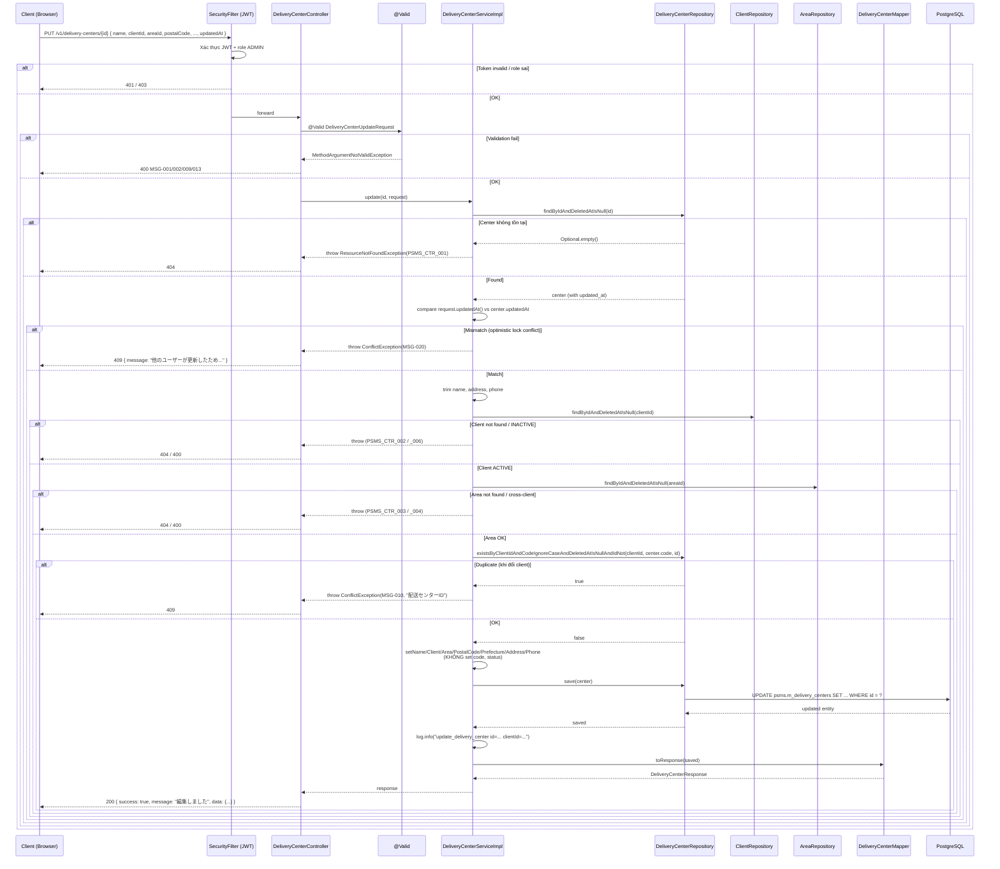

# Detail Design — M-03-update Delivery Center Update

## 1. Document Info

| Item | Value |
|---|---|
| Feature | Trung tâm phân phối (配送センター) — Chỉnh sửa |
| Screen ID | M-03-update (mode: **edit** — URL `/center/{id}/edit`) |
| Related | M-03 list (`/center`), M-03-cud create (`/center/new`), M-03-cud delete |
| Source | `documents/dev-basic-design/masters/delivery-centers/delivery-centers-update/basic-design.md` |
| DB Design | `specs/db-designs/db-overview/v3/1834-db-design.dbml` |
| Common Spec | `documents/dev-basic-design/common/common-spec.md` |
| Message Definition | `documents/dev-basic-design/common/message-definition.md` |
| Author | tiendv@hblab.vn |
| Reviewer | (pending) |
| Created | 2026-04-22 |
| Status | Draft |

---

## 2. Overview

API cho phép ADMIN chỉnh sửa bản ghi **Master trung tâm phân phối (配送センター)** đã tồn tại. Luồng 2 bước: (1) **GET** pre-load dữ liệu hiện tại để fill form M-03-cud mode **edit**; (2) **PUT** gửi dữ liệu mới kèm `updatedAt` để BE kiểm tra optimistic lock (楽観的ロック) trước khi ghi đè. `center_code` là **read-only** — không thay đổi sau khi bản ghi được tạo. Thành công → FE điều hướng về M-03 list kèm toast "編集しました".

**Actors:**
- ADMIN (管理者) — duy nhất được phép gọi 2 API này (BD §5 "Authorization").

**Preconditions:**
- Người dùng đã đăng nhập, JWT còn hiệu lực.
- Role = `ADMIN`.
- Record `id` tồn tại trong `m_delivery_centers` và chưa xóa mềm (`deleted_at IS NULL`).
- Client đã chọn trong form mới (có thể khác client hiện tại): `status = ACTIVE`, `deleted_at IS NULL`.
- Area đã chọn: `deleted_at IS NULL`, và `area.client_id = request.clientId`.

**Postconditions:**
- Các field (trừ `code`, `id`, `created_*`, `deleted_*`) được cập nhật.
- `updated_at = now()`, `updated_by = <user>` (tự động qua `@LastModifiedDate`/`@LastModifiedBy`).
- `status` giữ nguyên (không reset về ACTIVE).
- Response 200 OK kèm `DeliveryCenterResponse` (full detail 12 fields).
- Log: `update_delivery_center id={} clientId={}`.

---

## 3. DB Schema

> Reference: `delivery-centers-create/detail-design.md` §3.1 (sau V10 migration). Tóm tắt các cột ảnh hưởng bởi UPDATE:

### 3.1 Table `psms.m_delivery_centers` — UPDATE target

| Column | Updatable? | Notes |
|---|---|---|
| `id` | ❌ | PK, từ path param |
| `code` | ❌ | **Read-only per BD #5** — BE phải reject mọi thay đổi |
| `name` | ✅ | Trim, max 100 |
| `client_id` | ✅ | FK validate + ACTIVE check |
| `area_id` | ✅ | FK validate + cross-client check |
| `postal_code` | ✅ | Pattern `999-9999`, NOT NULL |
| `prefecture` | ✅ | NOT NULL |
| `address` | ✅ | Trim, max 255, NOT NULL |
| `phone` | ✅ | Optional, PhoneNumber format |
| `status` | ❌ (qua update API) | Chỉ đổi qua API riêng nếu có; update form không touch |
| `created_at`, `created_by` | ❌ | Immutable |
| `updated_at`, `updated_by` | 🔄 | Auto qua JPA auditing; **dùng làm optimistic lock token** |
| `deleted_at`, `deleted_by` | ❌ (qua update API) | Dùng qua delete API |

### 3.2 JOIN tables (cho pre-load + validate)

- `psms.m_clients` — resolve ACTIVE client (PSMS_CTR_006 nếu INACTIVE)
- `psms.m_areas` — resolve area cùng `client_id` (PSMS_CTR_004 nếu cross-client)

---

## 4. API Endpoints Summary

| # | Method | Path | Role | Description |
|---|---|---|---|---|
| 1 | GET | `/v1/delivery-centers/{id}` | ADMIN | Pre-load chi tiết center để fill form edit |
| 2 | PUT | `/v1/delivery-centers/{id}` | ADMIN | Cập nhật thông tin center + optimistic lock |

---

## 5. API Detail

### 5.1 GET /v1/delivery-centers/{id}

> **Status:** Đã có sẵn trong code hiện hành (`DeliveryCenterController#findById`). Scope chính của feature update là PUT — GET chỉ ghi tham chiếu.

#### Authorization

- Class-level `@PreAuthorize("hasRole('ADMIN')")`.

#### Request

| Path Param | Type | Description |
|---|---|---|
| `id` | `Long` | PK của `m_delivery_centers` |

#### Response — 200 OK

`ApiResponse<DeliveryCenterResponse>` — 12 fields (same schema với create response, bao gồm `updatedAt`).

> **Gap:** Response DTO hiện tại (`DeliveryCenterResponse`) **không có** `updatedAt`. BD §5 "Optimistic Locking" yêu cầu FE nhận `updatedAt` từ pre-load để gửi lại trong PUT. Xem §15 Gap-1.

#### Error Cases

| HTTP | Code | Condition |
|---|---|---|
| 401 | — | Thiếu/hết hạn JWT |
| 403 | — | Role ≠ ADMIN |
| 404 | `PSMS_CTR_001` | Center không tồn tại hoặc đã xóa mềm |

---

### 5.2 PUT /v1/delivery-centers/{id}

#### Authorization

- Security: `Bearer <JWT>` bắt buộc.
- Class-level: `@PreAuthorize("hasRole('ADMIN')")`.
- LOGISTICS / user chưa đăng nhập → 403 / 401.

#### Request

**Headers:**

| Header | Required | Value |
|---|---|---|
| `Authorization` | Yes | `Bearer <token>` |
| `Content-Type` | Yes | `application/json; charset=utf-8` |

**Path Param:**

| Param | Type | Description |
|---|---|---|
| `id` | `Long` | PK của record cần update |

**Request Body — `DeliveryCenterUpdateRequest`:**

```json
{
  "name":       "加古川配送センター（更新）",
  "clientId":   10,
  "areaId":     2,
  "postalCode": "675-0064",
  "prefecture": "兵庫県",
  "address":    "加古川市加古川町溝之口1番地",
  "phone":      "079-421-1234",
  "updatedAt":  "2026-04-22T10:30:45.123+09:00"
}
```

> **Lưu ý:** Không có `code` (BD #5 — read-only). Có `updatedAt` (ISO-8601 với timezone) — lấy từ pre-load GET response. BE dùng để optimistic lock.

**Validation rules:**

| Field | Type | Required | Constraints | Error code |
|---|---|---|---|---|
| `name` | `String` | Yes | Trim; 1–100 sau trim (BD #2) | `MSG-001`, `MSG-009` |
| `clientId` | `Long` | Yes | NOT NULL; `m_clients.status=ACTIVE`, `deleted_at IS NULL` | `MSG-001`, `PSMS_CTR_002`, `PSMS_CTR_006` |
| `areaId` | `Long` | Yes | NOT NULL; `m_areas.deleted_at IS NULL`; `area.client_id = request.clientId` | `MSG-001`, `PSMS_CTR_003`, `PSMS_CTR_004` |
| `postalCode` | `String` | Yes | Pattern `^\d{3}-\d{4}$`; max 10 (BD #6) | `MSG-001`, `MSG-002`, `MSG-009` |
| `prefecture` | `String` | Yes | Max 20 (BD #8) | `MSG-001`, `MSG-009` |
| `address` | `String` | Yes | Trim; max 255 (BD #9) | `MSG-001`, `MSG-009` |
| `phone` | `String` | No | Optional; strip + - space → 10/11 digits bắt đầu `0` (BD #10) | `MSG-009`, `MSG-013` |
| `updatedAt` | `ZonedDateTime` | Yes | NOT NULL; phải khớp `m_delivery_centers.updated_at` hiện tại trong DB | `MSG-001`, `MSG-020` |

**Không có trong request:**
- `code` — read-only (BD #5)
- `id` — lấy từ path param
- `status` — không đổi qua update form (BD không yêu cầu)
- `created_*`, `updated_*` (trừ `updatedAt` dùng lock), `deleted_*` — BE quản lý

#### Response

**200 OK** — `ApiResponse<DeliveryCenterResponse>`

```json
{
  "success": true,
  "message": "編集しました",
  "data": {
    "id": 15,
    "code": "kakogawa",
    "name": "加古川配送センター（更新）",
    "clientId": 10,
    "clientName": "ファミリーマート",
    "areaId": 2,
    "areaName": "関西",
    "postalCode": "675-0064",
    "prefecture": "兵庫県",
    "address": "加古川市加古川町溝之口1番地",
    "phone": "079-421-1234",
    "status": "ACTIVE"
  }
}
```

> `updatedAt` mới (post-save) nên được FE cache — nếu user muốn edit tiếp trên cùng trang, dùng làm lock token cho request tiếp theo.

#### Business Logic

1. **Authorization check** — Spring Security xác thực JWT + role `ADMIN`. Fail → 401/403.
2. **Bean Validation** — `@Valid` kích hoạt: name required/length, postal pattern, prefecture/address required/length, phone format, `updatedAt` NOT NULL. Fail → 400 MSG-001/002/009/013.
3. **Load record hiện tại** — `deliveryCenterRepository.findByIdAndDeletedAtIsNull(id)`:
   - Không tìm thấy → `ResourceNotFoundException(PSMS_CTR_001)` (404).
4. **Optimistic lock check** — so sánh `request.updatedAt()` với `center.getUpdatedAt()`:
   - Khác nhau → `BusinessException(MSG-020)` (400/409 tùy policy — dùng 409 CONFLICT phù hợp hơn). Thông điệp: `他のユーザーが更新したため保存できません。画面を再読み込みしてから再度お試しください。`
5. **Trim input** — `name` (BD #2), `address` (BD #9), `phone` (BD #10). `postalCode`/`prefecture` không trim (BD silent, nhất quán với create).
6. **Resolve ACTIVE Client** — `clientRepository.findByIdAndDeletedAtIsNull(clientId)`:
   - Không tìm thấy → `ResourceNotFoundException(PSMS_CTR_002)` (404).
   - `status != ACTIVE` → `BusinessException(PSMS_CTR_006)` (400).
7. **Resolve Area cross-client** — `areaRepository.findByIdAndDeletedAtIsNull(areaId)`:
   - Không tìm thấy → `ResourceNotFoundException(PSMS_CTR_003)` (404).
   - `area.client_id != request.clientId` → `BusinessException(PSMS_CTR_004)` (400).
8. **Uniqueness check (khi đổi client hoặc giữ client cũ)** — `existsByClientIdAndCodeIgnoreCaseAndDeletedAtIsNullAndIdNot(clientId, currentCode, id)`:
   - Dùng `currentCode = center.getCode()` (vì code read-only, lấy từ DB).
   - Trả `true` → `ConflictException(MSG-010, "配送センターID")` (409). Xảy ra khi user đổi `clientId` sang client khác đã có center cùng code.
9. **Apply changes** — gán trực tiếp vào `center` entity:
   - `setName(trimmedName)`
   - `setClient(client)` (có thể đổi)
   - `setArea(area)` (có thể đổi)
   - `setPostalCode(request.postalCode())`
   - `setPrefecture(request.prefecture())`
   - `setAddress(trimmedAddress)`
   - `setPhone(trimmedPhone)`
   - **Không** gán `code` — giữ nguyên theo BD #5 read-only.
   - **Không** gán `status` — BD không yêu cầu đổi qua update.
10. **Save** — `deliveryCenterRepository.save(center)`. Hibernate sinh UPDATE SQL, audit fields (`updated_at`, `updated_by`) tự cập nhật qua `@LastModifiedDate`/`@LastModifiedBy`.
11. **Log info** — `log.info("update_delivery_center id={} clientId={}", id, clientId)`.
12. **Map sang DTO** — `deliveryCenterMapper.toResponse(saved)`.
13. **Wrap response** — Controller trả `ApiResponse.ok("編集しました", response)` HTTP 200.

#### Error Cases

| HTTP | Code | Message (JP) | Nguyên nhân |
|---|---|---|---|
| 400 | `MSG-001` | `{項目名}を入力してください` | Field required bị null/blank |
| 400 | `MSG-002` | `半角英数字とハイフンのみで入力してください` | `postalCode` sai format `999-9999` |
| 400 | `MSG-009` | `{max-length}文字以内で入力してください` | Field vượt max length |
| 400 | `MSG-013` | `10桁または11桁で入力してください` | `phone` có giá trị nhưng không đúng 10/11 chữ số sau strip |
| 400 | `PSMS_CTR_004` | `このエリアは選択されたクライアントに属していません` | Area được chọn không thuộc Client được chọn |
| 400 | `PSMS_CTR_006` | `このクライアントは無効です` | Client tồn tại nhưng `status = INACTIVE` |
| 401 | — | (Spring Security default) | Thiếu/hết hạn JWT |
| 403 | — | (Spring Security default) | Role ≠ ADMIN |
| 404 | `PSMS_CTR_001` | `配送センターが見つかりません` | Center `id` không tồn tại hoặc đã xóa mềm |
| 404 | `PSMS_CTR_002` | `クライアントが見つかりません` | Client mới không tồn tại hoặc đã xóa mềm |
| 404 | `PSMS_CTR_003` | `エリアが見つかりません` | Area mới không tồn tại hoặc đã xóa mềm |
| 409 | `MSG-010` | `この配送センターIDは既に登録されています` | Đổi client sang client khác đã có center cùng code |
| 409 | `MSG-020` | `他のユーザーが更新したため保存できません。画面を再読み込みしてから再度お試しください。` | Optimistic lock — `updatedAt` không khớp |
| 500 | `MSG-022` | `システムエラーが発生しました。しばらくしてから再試行してください。` | DB lỗi / lỗi không kiểm soát |

#### Sequence Diagram



---

## 6. DTO Definitions

### 6.1 Request — `DeliveryCenterUpdateRequest` (NEW DTO)

```java
// jp.kreo.psms.dto.request.DeliveryCenterUpdateRequest
public record DeliveryCenterUpdateRequest(
    @NotBlank(message = "{MSG-001}")
    @Size(max = 100, message = "{MSG-009}")
    String name,

    @NotNull(message = "{MSG-001}")
    Long clientId,

    @NotNull(message = "{MSG-001}")
    Long areaId,

    @NotBlank(message = "{MSG-001}")
    @Size(max = 10, message = "{MSG-009}")
    @Pattern(regexp = "^\\d{3}-\\d{4}$", message = "{MSG-002}")
    String postalCode,

    @NotBlank(message = "{MSG-001}")
    @Size(max = 20, message = "{MSG-009}")
    String prefecture,

    @NotBlank(message = "{MSG-001}")
    @Size(max = 255, message = "{MSG-009}")
    String address,

    @Size(max = 20, message = "{MSG-009}")
    @PhoneNumber
    String phone,

    @NotNull(message = "{MSG-001}")
    ZonedDateTime updatedAt
) { }
```

> **Gap-1:** Hiện code dùng chung `DeliveryCenterRequest` cho cả create và update. BD yêu cầu 2 khác biệt lớn:
> - `code` không có trong update (read-only per BD #5)
> - `updatedAt` bắt buộc trong update (optimistic lock per BD §5)
>
> → Cần tạo DTO riêng `DeliveryCenterUpdateRequest`. Xem §15 Gap-1.

### 6.2 Response — `DeliveryCenterResponse` (đã có, cần bổ sung `updatedAt`)

```java
// jp.kreo.psms.dto.response.DeliveryCenterResponse
public record DeliveryCenterResponse(
    Long   id,
    String code,
    String name,
    Long   clientId,
    String clientName,
    Long   areaId,
    String areaName,
    String postalCode,
    String prefecture,
    String address,
    String phone,
    String status,
    ZonedDateTime updatedAt   // NEW field — để FE dùng làm lock token
) { }
```

> **Gap-2:** DTO hiện thiếu `updatedAt`. FE cần field này để gửi lại trong PUT request. Xem §15 Gap-2.

---

## 7. Service Contract

```java
// jp.kreo.psms.service.DeliveryCenterService
public interface DeliveryCenterService {
    /**
     * Cập nhật delivery center với optimistic lock.
     * @throws ResourceNotFoundException PSMS_CTR_001 nếu center không tồn tại
     * @throws ConflictException MSG-020 nếu updatedAt không khớp (optimistic lock)
     * @throws ResourceNotFoundException PSMS_CTR_002 nếu client không tồn tại
     * @throws BusinessException PSMS_CTR_006 nếu client INACTIVE
     * @throws ResourceNotFoundException PSMS_CTR_003 nếu area không tồn tại
     * @throws BusinessException PSMS_CTR_004 nếu area không thuộc client
     * @throws ConflictException MSG-010 nếu duplicate (clientId, code) — khi đổi client
     */
    DeliveryCenterResponse update(Long id, DeliveryCenterUpdateRequest request);
    // ... các method khác (findAll, findById, create, delete) — khác scope
}
```

---

## 8. Repository Methods Used

```java
// jp.kreo.psms.repository.DeliveryCenterRepository (đã có tất cả)
Optional<DeliveryCenter> findByIdAndDeletedAtIsNull(Long id);
boolean existsByClientIdAndCodeIgnoreCaseAndDeletedAtIsNullAndIdNot(Long clientId, String code, Long id);
// save(entity) ← inherited

// jp.kreo.psms.repository.ClientRepository
Optional<Client> findByIdAndDeletedAtIsNull(Long id);

// jp.kreo.psms.repository.AreaRepository
Optional<Area> findByIdAndDeletedAtIsNull(Long id);
```

Không cần bổ sung method mới.

---

## 9. Controller Signature

```java
// jp.kreo.psms.controller.DeliveryCenterController
@PutMapping("/{id}")
@Operation(summary = "Update an existing delivery center")
public ApiResponse<DeliveryCenterResponse> update(
        @PathVariable Long id,
        @Valid @RequestBody DeliveryCenterUpdateRequest request) {
    return ApiResponse.ok("編集しました", deliveryCenterService.update(id, request));
}
```

> Class-level `@PreAuthorize("hasRole('ADMIN')")` kế thừa.

---

## 10. Mapper

```java
// jp.kreo.psms.mapper.DeliveryCenterMapper (đã có — cần cập nhật cho updatedAt)
@Mapping(target = "clientId",   source = "client.id")
@Mapping(target = "clientName", source = "client.name")
@Mapping(target = "areaId",     source = "area.id")
@Mapping(target = "areaName",   source = "area.name")
@Mapping(target = "updatedAt",  source = "updatedAt")    // NEW mapping nếu DeliveryCenterResponse thêm field
DeliveryCenterResponse toResponse(DeliveryCenter entity);
```

---

## 11. Error Handling Summary

| Error Code | HTTP | Exception | Where thrown |
|---|---|---|---|
| `MSG-001` | 400 | `MethodArgumentNotValidException` | `@NotBlank` / `@NotNull` fail (bao gồm `updatedAt`) |
| `MSG-002` | 400 | `MethodArgumentNotValidException` | `@Pattern` fail cho `postalCode` |
| `MSG-009` | 400 | `MethodArgumentNotValidException` | `@Size` fail |
| `MSG-013` | 400 | `MethodArgumentNotValidException` | `@PhoneNumber` fail |
| `PSMS_CTR_001` | 404 | `ResourceNotFoundException` | Center `id` không tồn tại hoặc đã xóa mềm |
| `PSMS_CTR_002` | 404 | `ResourceNotFoundException` | Client mới không tồn tại |
| `PSMS_CTR_003` | 404 | `ResourceNotFoundException` | Area mới không tồn tại |
| `PSMS_CTR_004` | 400 | `BusinessException` | Area cross-client |
| `PSMS_CTR_006` | 400 | `BusinessException` | Client INACTIVE |
| `MSG-010` | 409 | `ConflictException` | Duplicate khi đổi client |
| `MSG-020` | 409 | `ConflictException` | Optimistic lock conflict |
| `MSG-022` | 500 | `Exception` (fallback) | `GlobalExceptionHandler#handleGeneral` |

**Error UX mapping (BD §5):**

| Status | UX hiển thị | Source |
|---|---|---|
| 400 (validation) | Inline đỏ dưới field | BD §5 "Validation: inline(đỏ)" |
| 404 `PSMS_CTR_001` | Toast đỏ + redirect M-03 | "Khi record không tồn tại → quay về list" |
| 409 `MSG-010` | Toast đỏ hoặc inline | BD §5 |
| 409 `MSG-020` | **Toast hoặc banner** với hướng dẫn reload trang | BD §5 "Optimistic lock conflict: toast hoặc banner" |
| 500 | Modal common-spec §4.1 (MSG-022) | — |

---

## 12. Testing Scenarios

### 12.1 Happy Path

| # | Scenario | Input | Expected |
|---|---|---|---|
| G-01 | Update all fields (cùng client, cùng area) | body đầy đủ + `updatedAt` khớp DB | 200 + response; DB có `updated_at` mới |
| G-02 | Update chỉ `name` | các field khác giữ nguyên | 200 |
| G-03 | Đổi sang client khác (có cùng code trống) | `clientId` mới có area mới | 200 |
| G-04 | `name` có whitespace | `"  加古川  "` | 200, DB chứa trimmed |
| G-05 | `phone` từ giá trị cũ → null (xóa phone) | `phone: null` | 200 |
| G-06 | `address` có whitespace | `"  住所  "` | 200, trimmed |

### 12.2 Edge Cases

| # | Scenario | Input | Expected |
|---|---|---|---|
| E-01 | `name` sát 100 ký tự | 100 chars | 200 |
| E-02 | `postalCode` mới format hợp lệ khác | `100-0001` | 200 |
| E-03 | Client vừa đổi INACTIVE giữa pre-load và PUT | race condition | 400 PSMS_CTR_006 |
| E-04 | Bản ghi bị soft-delete giữa pre-load và PUT | race condition | 404 PSMS_CTR_001 |
| E-05 | `updatedAt` gửi giá trị cũ đúng millisecond | khớp DB | 200 |
| E-06 | `updatedAt` sai 1ms | khớp không chính xác | 409 MSG-020 |
| E-07 | Gửi body có `code` field (nếu có) | field `code` bị strip hoặc ignore | 200 (không đổi code trong DB) |

### 12.3 Error Cases

| # | Scenario | Input | Expected |
|---|---|---|---|
| X-01 | Thiếu JWT | — | 401 |
| X-02 | Role LOGISTICS | — | 403 |
| X-03 | `id` không tồn tại | `id=9999` | 404 PSMS_CTR_001 |
| X-04 | `id` đã xóa mềm | — | 404 PSMS_CTR_001 |
| X-05 | Thiếu `updatedAt` | `updatedAt: null` | 400 MSG-001 |
| X-06 | `updatedAt` không khớp DB | user khác đã update trước | 409 MSG-020 |
| X-07 | Thiếu `name` | `name: null` | 400 MSG-001 |
| X-08 | `name` > 100 chars | 101 chars | 400 MSG-009 |
| X-09 | `postalCode` sai format | `"6750064"` | 400 MSG-002 |
| X-10 | `phone` invalid | `"abc"` | 400 MSG-013 |
| X-11 | Client mới không tồn tại | `clientId: 9999` | 404 PSMS_CTR_002 |
| X-12 | Client mới INACTIVE | — | 400 PSMS_CTR_006 |
| X-13 | Area mới không tồn tại | `areaId: 9999` | 404 PSMS_CTR_003 |
| X-14 | Area mới thuộc client khác | cross-client | 400 PSMS_CTR_004 |
| X-15 | Đổi sang client khác đã có center cùng code | duplicate | 409 MSG-010 |

---

## 13. Dependent APIs (External / Other Features)

### 13.1 Dropdown sources cho form M-03-cud edit

Giống feature create (§13.1 của `delivery-centers-create/detail-design.md`):
- `GET /v1/clients/dropdown` — ẩn soft-deleted, ẩn INACTIVE (common-spec §5.6 Detail screen)
- `GET /v1/areas/dropdown?clientId={id}` — lọc theo client đã chọn, ẩn soft-deleted + INACTIVE

### 13.2 Postal code lookup — **GAP-201 要確認**

BD §5 "Auto-fill Address" chỉ định nguồn tra cứu = **要確認** (chưa xác định). BE không cung cấp endpoint postal lookup trong scope hiện tại. FE sẽ quyết định theo direction của PM:
- Option A: FE gọi external service (ví dụ zipcloud.ibsnet.co.jp)
- Option B: BE tạo endpoint `GET /v1/postal-codes/{code}` làm proxy + cache
- Option C: Self-host `KEN_ALL.CSV` từ 日本郵便

→ **Pending PM confirm** trước khi implement.

### 13.3 Prefecture master — **GAP-202 要確認**

BD §3 #8 chỉ định master 都道府県 = **要確認** (danh mục cố định / API chưa quyết). FE có thể:
- Option A: Hardcode 47 都道府県
- Option B: BE cung cấp `GET /v1/prefectures`

→ **Pending PM confirm** trước khi implement.

### 13.4 Pre-load endpoint

- **GET `/v1/delivery-centers/{id}`** (§5.1) — đã sẵn trong code hiện hành. Cần bổ sung `updatedAt` vào response DTO (Gap-2).

---

## 14. FE Behavior Contract

| # | Sự kiện | Hành vi FE |
|---|---|---|
| F-01 | Vào `/center/{id}/edit` | (1) Gọi D-1 clients dropdown; (2) Gọi GET `/v1/delivery-centers/{id}` để pre-load data; (3) Cache `updatedAt` từ response; (4) Gọi D-2 areas dropdown với `clientId` từ response; (5) Pre-fill form; (6) Hiển thị `center_code` dạng **read-only** (disabled input hoặc text static) |
| F-02 | User đổi Client dropdown | Clear `areaId` đã chọn; gọi lại D-2 với `clientId` mới |
| F-03 | User nhập `postalCode` đủ format rồi blur | Gọi external postal API → auto-fill `prefecture` + `address`; thất bại → toast MSG-024 |
| F-04 | User click **Lưu** | FE validate client-side → PUT `/v1/delivery-centers/{id}` với body **không có `code`**, **có `updatedAt`** đã cache. Success 200 → toast "編集しました" → redirect `/center`. Update cached `updatedAt` nếu user ở lại page |
| F-05 | User click **Hủy** | KHÔNG hỏi xác nhận; redirect `/center` (BD §3 #12) |
| F-06 | Server trả 409 `MSG-020` (optimistic lock) | Hiển thị banner/toast: `他のユーザーが更新したため保存できません。画面を再読み込みしてから再度お試しください。`. Gợi ý user click "Reload" để fetch lại pre-load |
| F-07 | Server trả 409 `MSG-010` (duplicate khi đổi client) | Hiển thị lỗi inline dưới field `clientId` (vì user đã đổi client) hoặc toast |
| F-08 | Server trả 404 `PSMS_CTR_001` | Toast đỏ + redirect `/center` (record đã bị xóa giữa pre-load và PUT) |
| F-09 | Server trả 400 `PSMS_CTR_004` | Hiển thị lỗi inline dưới `areaId` |
| F-10 | Server trả 500 | Modal common-spec §4.1 (MSG-022) |

---

## 15. Notes & Assumptions

1. **`code` read-only per BD #5**: UI hiển thị static text, không gửi trong PUT body. BE dùng `center.getCode()` (giá trị từ DB) khi check uniqueness. Nếu FE bypass và gửi `code` trong body → BE **ignore** (không gán vào entity).

2. **Optimistic lock qua `updatedAt`** (BD §5): Request bắt buộc có `updatedAt`. BE so sánh với giá trị hiện tại trong DB — nếu khác → `MSG-020`. Đây là **pessimistic comparison**, không dùng JPA `@Version` (vì `updated_at` đã có trong BaseEntity, đổi sang `@Version` cần migration).

3. **Comparison `updatedAt` tới millisecond**: `ZonedDateTime.equals()` so đúng đến nanosecond. PostgreSQL `TIMESTAMPTZ` độ chính xác 1 microsecond. JSON serialize/deserialize ISO-8601 có thể mất precision nhỏ nếu không configure đúng. Khuyến nghị config Jackson với `SerializationFeature.WRITE_DATES_AS_TIMESTAMPS=false` + `JavaTimeModule` (đã có trong Spring Boot 4).

4. **`status` không đổi qua update form**: BD không liệt kê `status` trong form fields (§3). Update API giữ nguyên status hiện tại. Nếu cần đổi status (ví dụ INACTIVE → ACTIVE) cần API riêng hoặc thêm checkbox trong form (scope sau).

5. **Trim policy giống create**: Trim `name`, `address`, `phone` theo BD #2/#9/#10. `postalCode`, `prefecture` BD silent → giữ không trim.

6. **Duplicate check khi đổi client**: Chỉ xảy ra khi user đổi `clientId` — vì `code` read-only, cùng client thì chắc chắn không duplicate (DB unique constraint đã enforce). Check vẫn chạy defense-in-depth.

7. **Client ACTIVE check**: Giống create — BE verify `status=ACTIVE` defensively dù FE dropdown đã ẩn INACTIVE.

8. **Area status không check**: Giống create — BD không yêu cầu, giữ code hiện hành.

9. **Audit columns**: `updated_at`, `updated_by` tự cập nhật qua Spring Data JPA auditing. `@LastModifiedBy` lấy từ `Authentication.name`.

10. **Gaps so với code hiện có trong repo**:
    - **Gap-1:** Tạo DTO mới `DeliveryCenterUpdateRequest`: **bỏ `code`**, **thêm `updatedAt`**. Hiện code dùng chung `DeliveryCenterRequest` cho create+update — vi phạm BD #5 (code phải read-only trong update) và BD §5 (cần optimistic lock).
    - **Gap-2:** Thêm field `updatedAt` vào `DeliveryCenterResponse` để FE cache làm lock token. Thêm `@Mapping(target="updatedAt", source="updatedAt")` vào MapStruct.
    - **Gap-3:** `DeliveryCenterController#update` signature đổi từ `@RequestBody DeliveryCenterRequest` → `@RequestBody DeliveryCenterUpdateRequest`.
    - **Gap-4:** `DeliveryCenterServiceImpl#update` signature đổi; thêm optimistic lock check (`if (!request.updatedAt().equals(center.getUpdatedAt())) throw ConflictException(MSG-020)`); bỏ `setCode(...)` (giữ code cũ); dùng `center.getCode()` khi check duplicate (thay vì `request.code()`).
    - **Gap-5:** Bổ sung `MessageCode.MSG_020` vào enum (nếu chưa có — kiểm tra `message-definition.md:20` confirm MSG-020 có). `messages_ja.properties` cần entry `MSG-020=他のユーザーが更新したため保存できません。画面を再読み込みしてから再度お試しください。`.
    - **Gap-6:** Existing tests cho `update()` đều dùng `DeliveryCenterRequest` — cần viết lại cho `DeliveryCenterUpdateRequest` + thêm scenario MSG-020.

11. **Phạm vi endpoint**: 2 endpoint (GET + PUT) nhưng GET đã có. Scope feature này chỉ modify PUT + response DTO + 1 DTO mới.

12. **Open questions theo BD (要確認 — không tự pre-resolve)**:
    - **GAP-201** (BD §5): Nguồn tra cứu 郵便番号 — BD đánh dấu 要確認. Detail-design §13.2 liệt kê 3 options khả dĩ (FE external / BE proxy / self-host). Chờ PM confirm trước khi implement.
    - **GAP-202** (BD §3 #8): Master 都道府県 — BD đánh dấu 要確認. Detail-design §13.3 liệt kê 2 options (FE hardcode / BE master endpoint). Chờ PM confirm.
    - BD-update **không có** gap "duplicate với record đã xóa mềm" (vì `code` read-only per BD #5 — không thể đổi code, không tạo scenario duplicate cross-soft-deleted).

---

**Lịch sử phiên bản**

| Version | Date | Author | Description |
|---|---|---|---|
| 1.0 | 2026-04-22 | tiendv@hblab.vn | Initial detail-design từ BD M-03-update; 2 APIs (GET + PUT); thêm DTO `DeliveryCenterUpdateRequest`, field `updatedAt` cho Response, optimistic lock via `MSG-020` |
| 1.1 | 2026-04-22 | tiendv@hblab.vn | Open questions chuyển về 要確認 đúng theo BD (không tự pre-resolve): GAP-201 postal lookup + GAP-202 prefecture master đều pending PM |
