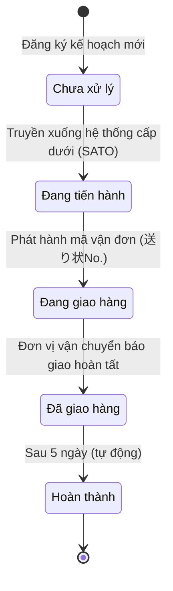
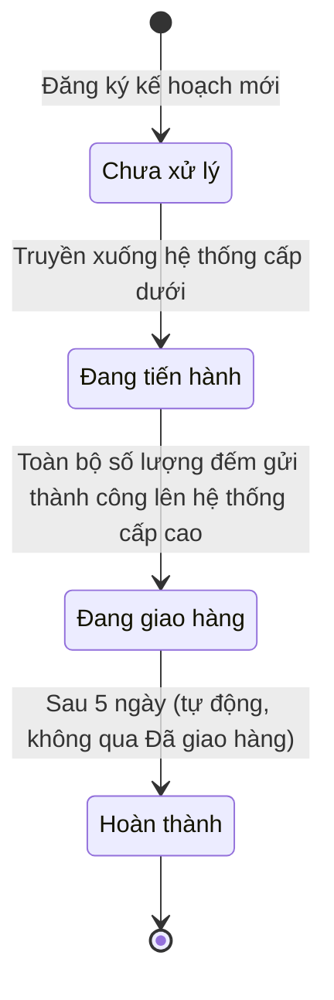

# D-14 Đặc tả màn hình

## 1. Tổng quan

- **Màn hình ID**: T-01
- **Tên màn hình**: Danh sách Kế hoạch（企画一覧）— Trang chủ（TOP）
- **URL (dự kiến)**: `/`（Trang chủ）
- **Mục đích**: Hiển thị **danh sách các kế hoạch（企画）**（đơn đặt hàng / chiến dịch triển khai）và cho phép **xác nhận trạng thái tiến độ** của từng kế hoạch; hỗ trợ **sắp xếp**, **lọc / tìm kiếm** và điều hướng tới màn hình chi tiết kế hoạch khi cần.
- **Mật độ hiển thị (Density)**: **Dày đặc (Dense)** — theo `FM資材管理システム_画面UIデザイン一覧表.md` và thiết kế tham chiếu.
- **Quyền truy cập**: Tài khoản thuộc vai trò **Quản lý（管理）** và **Hậu cần / Logistics（物流）** được phép sử dụng màn hình này.
- **Tổng quan chức năng**: **Bảng** danh sách kế hoạch kèm **Badge trạng thái**; **khu vực lọc / tìm kiếm**（khách hàng, khoảng thời gian triển khai, ngày xuất kho dự kiến, ngày giao hàng dự kiến, trạng thái, từ khóa tên kế hoạch hoặc ID）; **sắp xếp** theo các cột **ID**, **Ngày xuất kho dự kiến（出荷予定日）**, **Ngày giao hàng dự kiến（納品予定日）**; **phân trang**（cỡ trang mặc định — **GAP-701**）.

## 2. Bố cục màn hình

> [!NOTE]
> Tham chiếu layout: `Requirement/画面一覧_image/T-01_企画一覧（トップ）.png`. Triển khai thực tế dùng shell / menu chung của hệ thống; cấu trúc khối và UX tương đương thiết kế.

**Cấu trúc khối（từ trên xuống）**

1. **Tiêu đề / vùng nhận diện trang TOP**（企画一覧）
2. **Khu vực lọc / tìm kiếm（絞り込み検索）**
   - **Tên khách hàng（クライアント）**: dropdown（chọn）
   - **Thời gian triển khai（展開期間）**: chọn **khoảng ngày**（date range）
   - **Ngày xuất kho dự kiến（出荷予定日）**: một ngày（date）
   - **Ngày giao hàng dự kiến（納品予定日）**: một ngày（date）
   - **Trạng thái（ステータス）**: dropdown
   - **Tìm theo tên kế hoạch hoặc ID**: ô nhập text
   - Nút **Tìm / áp dụng lọc**（theo chuẩn UI chung — **GAP-702**）
3. **Bảng danh sách kế hoạch**: hiển thị các cột nghiệp vụ（xem mục 3）; header cột cho phép **sắp xếp** đối với **ID**, **出荷予定日**, **納品予定日**
4. **Phân trang**
5. **Liên kết / điều hướng**（nếu có trên wireframe）: ví dụ chuyển tới **P-01 企画詳細（作業ステータス確認）** khi chọn một dòng hoặc ID — **GAP-703**（đường dẫn cụ thể: tham chiếu `D-01` và spec **P-01**）

## 3. Danh sách phần tử UI

| No. | Tên phần tử | Loại | Mô tả | Hành vi khi thao tác | Quy tắc kiểm tra | Ghi chú |
| --- | --- | --- | --- | --- | --- | --- |
| 1 | Tiêu đề màn hình | Văn bản (tĩnh) | Nhận diện màn hình TOP / danh sách kế hoạch | - | - | - |
| 2 | Dropdown lọc tên khách hàng | Dropdown | Danh sách khách hàng（master **クライアント**）để lọc kế hoạch theo khách hàng; **không hiển thị** bản ghi **đã xóa mềm**, **hiển thị** bản ghi **tạm dừng** để vẫn có thể tra cứu kế hoạch liên quan | **Khi thay đổi:** giữ giá trị; kết hợp với nút áp dụng lọc hoặc auto-apply theo chuẩn dự án | - | Giá trị rỗng = không lọc theo khách hàng |
| 3 | Bộ chọn khoảng thời gian triển khai | Date range | Lọc theo **展開期間** của kế hoạch（ngày bắt đầu–kết thúc hoặc quy ước tương đương trong DB） | **Khi thay đổi:** giữ giá trị; áp dụng theo luật lọc mục 5 | Ngày kết thúc ≥ ngày bắt đầu（nếu cả hai được nhập） | **GAP-704** — định nghĩa chính xác “nằm trong khoảng” |
| 4 | Chọn ngày xuất kho dự kiến | Date picker | Lọc theo **出荷予定日**（một ngày） | **Khi thay đổi:** giữ giá trị | Định dạng ngày theo chuẩn UI dự án | Ô trống = không áp dụng điều kiện này |
| 5 | Chọn ngày giao hàng dự kiến | Date picker | Lọc theo **納品予定日**（một ngày） | **Khi thay đổi:** giữ giá trị | Định dạng ngày theo chuẩn UI dự án | Ô trống = không áp dụng điều kiện này |
| 6 | Dropdown trạng thái | Dropdown | Lọc theo **ステータス** kế hoạch（5 giá trị nghiệp vụ + “Tất cả” nếu có） | **Khi thay đổi:** giữ giá trị | - | Giá trị rỗng / Tất cả = không lọc theo trạng thái |
| 7 | Ô tìm theo tên kế hoạch hoặc ID | Ô nhập (text) | Tìm theo **企画名** hoặc **ID**（một ô） | **Khi áp dụng lọc:** trim đầu/cuối; sau trim rỗng → không áp dụng điều kiện này | Độ dài tối đa: **GAP-705** | Cách khớp（một phần / đầu chuỗi / chính xác ID）: **GAP-706** |
| 8 | Nút áp dụng lọc / Tìm | Nút | Gửi điều kiện lọc lên server（hoặc áp dụng client theo chuẩn） | **Khi nhấn:** tải lại danh sách; thường reset về trang 1 | - | Đồng bộ với **GAP-702** |
| 10 | Bảng danh sách kế hoạch | Bảng | Danh sách kế hoạch thỏa điều kiện lọc và phân trang | - | - | Xem các cột con; **Dense** |
| 10-1 | Cột ID | Cột bảng (có thể sort) | Định danh kế hoạch | **Khi nhấn header:** sắp xếp tăng/giảm（toggle） | - | Sort 1 trong 3 cột được phép |
| 10-2 | Cột tên kế hoạch | Cột bảng | **企画名** | **Khi nhấn dòng / liên kết（nếu có）:** điều hướng **P-01** — **GAP-703** | - | - |
| 10-3 | Cột khách hàng | Cột bảng | Tên khách hàng（tham chiếu master） | - | - | - |
| 10-4 | Cột thời gian triển khai | Cột bảng | Hiển thị khoảng **展開期間**（định dạng — **GAP-707**） | - | - | - |
| 10-5 | Cột ngày xuất kho dự kiến | Cột bảng (có thể sort) | **出荷予定日** | **Khi nhấn header:** sắp xếp | - | Sort 1 trong 3 cột được phép |
| 10-6 | Cột ngày giao hàng dự kiến | Cột bảng (có thể sort) | **納品予定日** | **Khi nhấn header:** sắp xếp | - | Sort 1 trong 3 cột được phép |
| 10-7 | Cột trạng thái | Cột bảng | **Badge** hiển thị 1 trong 5 trạng thái（luồng thường）hoặc luồng **チャーター** — mục 5 | - | - | Màu / nhãn theo guideline UI |
| 10-8 | Cột thao tác / liên kết chi tiết | Cột bảng (tuỳ chọn) | Vào chi tiết kế hoạch | **Khi nhấn:** chuyển **P-01**（hoặc URL `/plan/{id}` theo spec hệ thống） | - | Chỉ bố trí nếu wireframe có; nếu không, click cả dòng — **GAP-703** |
| 11 | Phân trang | Phân trang | Điều khiển trang | **Khi đổi trang:** tải dữ liệu; giữ điều kiện lọc và sort | - | Cỡ trang mặc định: **GAP-701** |

## 4. Hành động và chuyển màn hình

| Hành động | Kích hoạt | Nội dung xử lý | Màn hình đích |
| --- | --- | --- | --- |
| Hiển thị ban đầu | Vào `/`（sau đăng nhập） | Tải trang 1; áp dụng sort mặc định（**GAP-708**）; cỡ trang **GAP-701**; chưa áp dụng lọc cho đến khi người dùng thao tác（hoặc theo chuẩn dự án） | - |
| Lọc / Tìm kiếm | Nhấn áp dụng lọc | Gửi các điều kiện: khách hàng, khoảng triển khai, ngày xuất kho, ngày giao hàng, trạng thái, text tên/ID; **giữa các nhóm điều kiện là AND**; ô trống sau trim không tham gia; reset về trang 1 | - |
| Sắp xếp | Nhấn header **ID** / **出荷予定日** / **納品予定日** | Đổi thứ tự sort（ASC/DESC）; chỉ một tiêu chí sort chính tại một thời điểm（**GAP-709** nếu cho phép multi-sort） | - |
| Mở chi tiết kế hoạch | Click dòng / ID / nút chi tiết | Nạp context kế hoạch đã chọn | **P-01** — 企画詳細（作業ステータス確認）（URL dự kiến `/plan/{id}` — khớp `D-01` / spec P-01） |
| Phân trang | Chọn trang | Tải trang đích; giữ lọc và sort | - |

## 5. Bổ sung

### Sắp xếp và phân trang

- **Sort theo yêu cầu**: chỉ các cột **ID**, **出荷予定日**, **納品予定日** là đối tượng sort.
- **Sort mặc định**: **GAP-708**（ví dụ: theo ID giảm dần hoặc theo 出荷予定日 tăng dần — cần thống nhất BA/PM）.
- **Phân trang**: cỡ trang mặc định **GAP-701**; hiển thị tổng số bản ghi nếu UI chung có.

### Tìm kiếm / Lọc

- **Khách hàng**: dropdown — danh sách từ master khách hàng（**không hiển thị** bản ghi **đã xóa mềm**, **hiển thị** bản ghi **tạm dừng**）.
- **Thời gian triển khai**: date range — kế hoạch có **展開期間** giao với khoảng đã chọn（**GAP-704**）.
- **Ngày xuất kho / Ngày giao hàng dự kiến**: lọc theo đúng ngày（hoặc quy ước timezone — **GAP-711**）.
- **Trạng thái**: dropdown theo 5 trạng thái nghiệp vụ（mục dưới）.
- **Tên kế hoạch hoặc ID**: một ô text — **GAP-706**.

### Quản lý trạng thái kế hoạch（ステータス）

Trạng thái hiển thị trên danh sách（và lọc）gom nhóm hai luồng: **vận chuyển thông thường** và **xe Charter（チャーター）**.

**Bộ giá trị trạng thái（nhãn hiển thị — có thể map mã nội bộ）**

| Mã gợi ý (JP) | Tiếng Việt |
| --- | --- |
| 未対応 | Chưa xử lý |
| 進行中 | Đang tiến hành |
| 配送中 | Đang giao hàng |
| 配達完了 | Đã giao hàng |
| 完了 | Hoàn thành |

**Luồng thông thường（非チャーター）**

| Trạng thái | Điều kiện chuyển sang trạng thái này |
| --- | --- |
| Chưa xử lý | Kế hoạch **mới được đăng ký** trên hệ thống. |
| Đang tiến hành | Khi **thông tin kế hoạch đã được truyền xuống hệ thống cấp dưới**（hệ thống SATO / 下位システム）. |
| Đang giao hàng | Khi **mã vận đơn（送り状No.）đã được phát hành**. |
| Đã giao hàng | Khi **trạng thái giao hàng từ đơn vị vận chuyển báo là hoàn thành**（配送ステータス＝完了）. |
| Hoàn thành | **Tự động** chuyển sau **5 ngày** kể từ khi đạt trạng thái **Đã giao hàng**. |

**Luồng xe Charter（チャーター）**

| Trạng thái | Điều kiện chuyển sang trạng thái này |
| --- | --- |
| Chưa xử lý | Kế hoạch **mới được đăng ký**. |
| Đang tiến hành | Khi **thông tin đã được gửi xuống hệ thống cấp dưới**. |
| Đang giao hàng | Khi **toàn bộ số lượng đếm được gửi thành công lên hệ thống cấp cao** mà **không có lỗi / vấn đề**（上位システムへ数量連携成功）. |
| Hoàn thành | **Tự động** sau **5 ngày** kể từ khi đạt trạng thái **Đang giao hàng** — **không có** bước **Đã giao hàng** trong luồng Charter. |

**Lưu ý**: Kế hoạch **Charter** phân biệt với không Charter bằng cờ / loại kế hoạch trong dữ liệu（**GAP-712** — trường phân loại trong DB hoặc master）.

### Sơ đồ trạng thái（ステートマシン）

**Luồng thông thường**

**Luồng Charter**

- **Không cho phép** người dùng chỉnh sửa tay các chuyển trạng thái tự động trên màn **T-01**（chỉ hiển thị; cập nhật do batch / liên kết vận chuyển / đồng bộ — **GAP-713**）.

### Dữ liệu nguồn và snapshot（bảng danh sách）

Thực thể nghiệp vụ **企画** được tham chiếu trong `FM資材管理システム_データ定義書.md`（mục トランザクション — 企画）. Chi tiết bảng vật lý và cột: **D-20 / thiết kế DB dự án** khi có.

| Cột hiển thị (gợi ý) | Nguồn / ghi chú |
| --- | --- |
| ID | Khóa kế hoạch |
| Tên kế hoạch | 企画名 |
| Khách hàng | Join master クライアント |
| Thời gian triển khai | 展開期間（from–to） |
| Ngày xuất kho dự kiến | 出荷予定日 |
| Ngày giao hàng dự kiến | 納品予定日 |
| Trạng thái | Cột trạng thái nội bộ + luồng Charter（GAP-712） |

### Quyền

| Thao tác | Quản lý（管理） | Logistics（物流） | Vai trò khác |
| --- | --- | --- | --- |
| Truy cập `/`, xem danh sách, lọc, sort, phân trang | Có | Có | Không |
| Mở chi tiết kế hoạch（P-01） | Có | Có | Không |

### Xử lý lỗi và cách hiển thị

- **Lỗi tải danh sách / mạng**: toast（đỏ）hoặc thông báo theo **D-00_Message definition.md**.
- **Danh sách rỗng**: empty state（không có kế hoạch thỏa điều kiện）.
- **Hiển thị**: lỗi validation ô lọc（nếu có）— **dưới ô**（inline đỏ）; lỗi hệ thống — **toast** theo chuẩn dự án.

### Yêu cầu phi chức năng（hiệu năng）

- Mục tiêu tham khảo: tải một trang danh sách **dưới 3 giây**（quy mô do PM định; màn Dense có thể nhiều cột — cần kiểm tra thực tế）.

### Liên kết module / I/F

- Đồng bộ trạng thái với **hệ thống cấp dưới（SATO）**, **phát hành 送り状No.**, **trạng thái vận chuyển**, **đồng bộ số lượng lên hệ thống cấp cao（Charter）**: chi tiết **IF-ID / API** ghi trong tài liệu liên kết（**SATO社_クレオ様連携データに関して** 等）— màn T-01 chỉ **hiển thị kết quả**; không mô tả contract API trong file này.

### GAP

- **GAP-701** — Cỡ trang mặc định（số dòng/trang）.
- **GAP-702** — Nhãn nút và cơ chế áp dụng lọc（submit vs realtime / auto-apply）.
- **GAP-703** — Cách điều hướng tới P-01（click dòng vs cột vs URL）.
- **GAP-704** — Quy tắc so khớp **展開期間** với date range.
- **GAP-705** — Giới hạn độ dài ô tìm text.
- **GAP-706** — Kiểu khớp tên kế hoạch vs ID.
- **GAP-707** — Định dạng hiển thị **展開期間** trên bảng.
- **GAP-708** — Sort mặc định khi vào màn hình.
- **GAP-709** — Single-sort vs multi-sort.
- **GAP-711** — Timezone / ngày theo calendar nào.
- **GAP-712** — Cờ / trường phân biệt **チャーター** trong dữ liệu kế hoạch.
- **GAP-713** — Cơ chế cập nhật trạng thái tự động（batch, webhook, polling）.

---

**Lịch sử phiên bản**
| 日付 | バージョン | 改訂内容 | 担当者 |
| --- | --- | --- | --- |
| 2026-04-17 | 1.0 | 新規作成 | HieuNT1 |